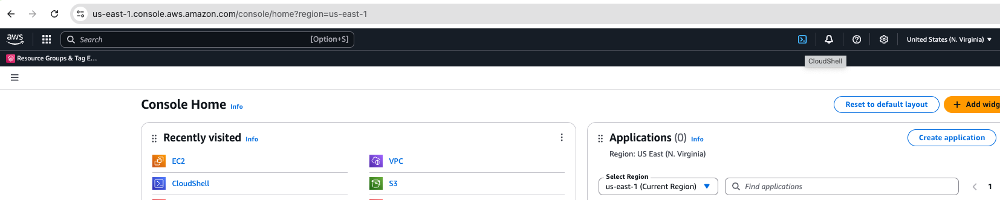
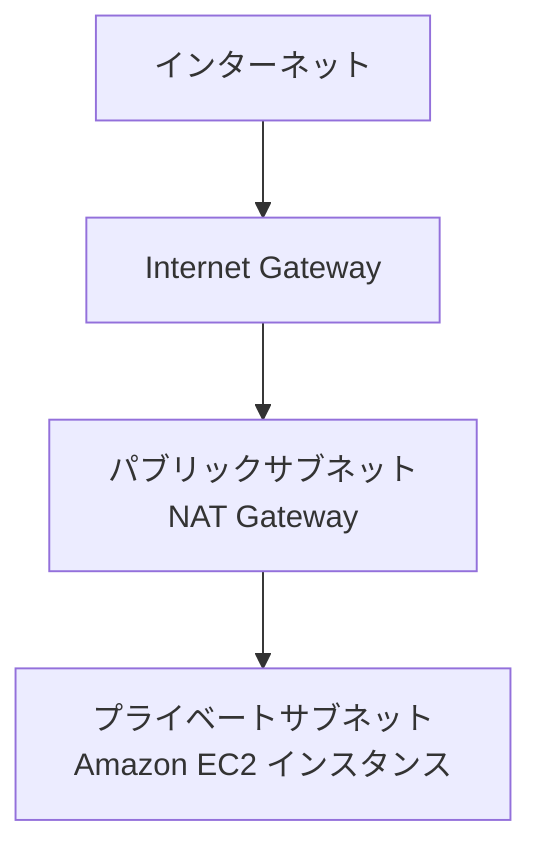

# EC2 with SSM Access and VS Code Server CloudFormation Templates

このディレクトリには、 AWS Systems Manager アクセス可能で VS Code Server を実行する Amazon EC2 インスタンスをセットアップするための 2 つの AWS CloudFormation テンプレートが含まれています。

## 実行環境の選択

以下のいずれかの環境でコマンドを実行できます：

### AWS CloudShell を使用する場合

AWS CloudShell は AWS マネジメントコンソールから直接利用できる、ブラウザベースのシェル環境です。
コンソール右上の AWS CloudShell アイコンをクリックして起動できます。

 

AWS CloudShell 内に AWS CloudFormation テンプレートをダウンロードします。

```
curl -O https://raw.githubusercontent.com/littlemex/ec2-cfn-templates-for-genai/main/cline/ec2-ssm.yml
```

### ローカル環境を使用する場合

> **必要なツール**:
> - AWS CLI がインストールされていること
> - AWS 認証情報が適切に設定されていること


## テンプレート

- `ec2-ssm.yml` - 新しい Amazon VPC を作成する場合
   - 完全に独立した Amazon VPC 環境を構築
   - Amazon NAT Gateway 経由でインターネットアクセス
   - プライベートサブネットに Amazon EC2 を配置
   - Internet Gateway、NAT Gateway、パブリック/プライベートサブネットの完全な構成
   - より高いセキュリティが必要な環境に推奨

## ネットワーク構成の詳細

### ec2-ssm.yml の構成



- Internet Gateway を介してパブリックサブネットがインターネットに接続
- NAT Gateway を介してプライベートサブネットからインターネットにアクセス可能
- Amazon EC2 インスタンスはプライベートサブネットに配置され、直接のインターネットアクセスを制限

## デプロイ方法

### 共通操作

リソース名の重複を防ぐため、任意の USERNAME を設定します。
なお、CloudFormation のスタック名にはアンダースコア（_）を使用できないため、USERNAME にはハイフン（-）を使用してください。

```
export USERNAME=(各自で任意の値を入力 - アンダースコアは使用不可)
```

### ec2-ssm.yml

```bash
aws cloudformation deploy \
  --template-file ec2-ssm.yml \
  --stack-name ai-workshop-${USERNAME} \
  --parameter-overrides \
    UserName=${USERNAME} \
    Environment=dev \
  --capabilities CAPABILITY_NAMED_IAM
```

## アクセス方法

1. AWS CLI と AWS Systems Manager Session Manager プラグインをインストール

2. インスタンスの起動まで約 5-10 分待ちます

3. スタックの出力を確認します：
   ```bash
   # スタックの出力を確認
   aws cloudformation describe-stacks \
     --stack-name ai-workshop-${USERNAME} \
     --query 'Stacks[0].Outputs' \
     --output table
   ```

## VS Code Server へのアクセス

> **注意**:
> - `<インスタンス ID>` は AWS CloudFormation スタックの出力から確認できます
> - ポートフォワードコマンドはローカル環境で実行する必要があります
> - port_forward.py を使用する場合は Python と uv の事前インストールが必要です

1. ポートフォワードを設定します。以下のいずれかの方法を選択してください：

   a. AWS CLI を使用する場合：

   スタックの出力で `PortForwardCommand` として確認できます。

   ```bash
   aws ssm start-session \
     --target <インスタンス ID> \
     --region us-east-1 \
     --document-name AWS-StartPortForwardingSession \
     --parameters '{"portNumber":["8080"],"localPortNumber":["18080"]}'
   ```

   成功した場合は
   ```bash
   Starting session with SessionId: {セッションID}
   Port 18080 opened for sessionId {セッションID}
   ```
   と出力されます。

   ```bash
   An error occurred (TargetNotConnected) when calling the StartSession operation: {インスタンスID} is not connected.
   ```
   とエラーが出る場合は認証情報を確認し、数分待ちます。以前接続できない場合にはマネジメントコンソールからインスタンスを再起動してください。

2. ブラウザで http://localhost:18080 にアクセスし、VS Code Server に接続します。

3. VS Code にアクセスできたら以下のコマンドを実行して今後の作業に必要なツールがインストールされているか確認してください。
   ```bash
   mise install
   source ~/.bashrc
   node -v
   # v22.15.0
   python --version
   # Python 3.10.17
   docker -v
   # Docker version 28.1.1, build 4eba377
   aws --version
   # aws-cli/2.27.2 Python/3.13.2 Linux/6.8.0-1024-aws exe/x86_64.ubuntu.24
   uv --version
   # uv 0.6.16
   ```

   > **注意**: もしこれらのコマンドのいずれかでエラーが発生する場合や、期待されるバージョンと異なる場合は、[Docker と mise のインストールエラー](#docker-と-mise-のインストールエラー)セクションの手順に従って、必要なツールを手動でインストールしてください。

## パラメータ一覧

### 共通パラメータ

| パラメータ名 | 説明 | デフォルト値 |
|------------|------|------------|
| UserName | リソース名の競合を防ぐためのユーザー名（英数字とハイフンが使用可能） | (必須) |
| Environment | 環境名（ dev/stg/prod ） | dev |
| InstanceType | Amazon EC2 インスタンスタイプ | m5.large |
| Region | AWS リージョン | us-east-1 |
| AmiId | EC2 インスタンスの AMI ID | ami-084568db4383264d4 |
| EbsVolumeSize | Amazon EBS ボリュームサイズ（ GB ） | 30 |
### ec2-ssm.yml 固有のパラメータ

| パラメータ名 | 説明 | デフォルト値 |
|------------|------|------------|
| VpcCidr | Amazon VPC の CIDR ブロック | 10.0.0.0/16 |
| PublicSubnet1Cidr | パブリックサブネット 1 の CIDR | 10.0.1.0/24 |
| PrivateSubnet1Cidr | プライベートサブネット 1 の CIDR | 10.0.2.0/24 |
| AvailabilityZone1 | アベイラビリティゾーン 1 | us-east-1a |

## トラブルシューティング

### cloud-init ログの確認

インスタンスの初期化プロセスで問題が発生した場合、以下のコマンドで cloud-init のログを確認できます：

```bash
sudo cat /var/log/cloud-init-output.log
```

## セキュリティに関する注意事項

1. 環境構築後は、不要なリソースを削除してコストを最適化してください

## スタックの削除

環境が不要になった場合は、以下のコマンドでスタックを削除できます：

```bash
aws cloudformation delete-stack --stack-name ai-workshop-${USERNAME}
```
