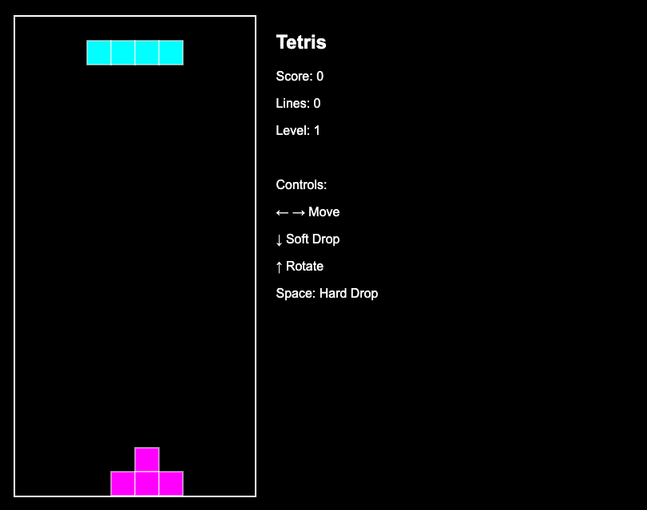

## 最も簡単なコーディングエージェント体験

### 環境準備

まずは Amazon Q Developer CLI を導入しましょう。

[README-qdev.md](./README-qdev.md) を確認してください。

### 動作確認

以下のコマンドをコピーしてターミナルに貼り付けてみてください。

```bash
q chat --no-interactive "こんにちは"
```

以下のような結果が返ってくれば正常に動作しています。

```

    ⢠⣶⣶⣦⠀⠀⠀⠀⠀⠀⠀⠀⠀⠀⠀⠀⠀⠀⠀⠀⠀⠀⠀⠀⠀⠀⠀⠀⠀⠀⠀⠀⠀⠀⠀⠀⠀⠀⠀⠀⠀⠀⠀⠀⠀⠀⠀⠀⠀⠀⠀⠀⠀⠀⠀⠀⠀⠀⠀⠀⠀⠀⠀⠀⢀⣤⣶⣿⣿⣿⣶⣦⡀⠀
 ⠀⠀⠀⣾⡿⢻⣿⡆⠀⠀⠀⢀⣄⡄⢀⣠⣤⣤⡀⢀⣠⣤⣤⡀⠀⠀⢀⣠⣤⣤⣤⣄⠀⠀⢀⣤⣤⣤⣤⣤⣤⡀⠀⠀⣀⣤⣤⣤⣀⠀⠀⠀⢠⣤⡀⣀⣤⣤⣄⡀⠀⠀⠀⠀⠀⠀⢠⣿⣿⠋⠀⠀⠀⠙⣿⣿⡆
 ⠀⠀⣼⣿⠇⠀⣿⣿⡄⠀⠀⢸⣿⣿⠛⠉⠻⣿⣿⠛⠉⠛⣿⣿⠀⠀⠘⠛⠉⠉⠻⣿⣧⠀⠈⠛⠛⠛⣻⣿⡿⠀⢀⣾⣿⠛⠉⠻⣿⣷⡀⠀⢸⣿⡟⠛⠉⢻⣿⣷⠀⠀⠀⠀⠀⠀⣼⣿⡏⠀⠀⠀⠀⠀⢸⣿⣿
 ⠀⢰⣿⣿⣤⣤⣼⣿⣷⠀⠀⢸⣿⣿⠀⠀⠀⣿⣿⠀⠀⠀⣿⣿⠀⠀⢀⣴⣶⣶⣶⣿⣿⠀⠀⠀⣠⣾⡿⠋⠀⠀⢸⣿⣿⠀⠀⠀⣿⣿⡇⠀⢸⣿⡇⠀⠀⢸⣿⣿⠀⠀⠀⠀⠀⠀⢹⣿⣇⠀⠀⠀⠀⠀⢸⣿⡿
 ⢀⣿⣿⠋⠉⠉⠉⢻⣿⣇⠀⢸⣿⣿⠀⠀⠀⣿⣿⠀⠀⠀⣿⣿⠀⠀⣿⣿⡀⠀⣠⣿⣿⠀⢀⣴⣿⣋⣀⣀⣀⡀⠘⣿⣿⣄⣀⣠⣿⣿⠃⠀⢸⣿⡇⠀⠀⢸⣿⣿⠀⠀⠀⠀⠀⠀⠈⢿⣿⣦⣀⣀⣀⣴⣿⡿⠃
 ⠚⠛⠋⠀⠀⠀⠀⠘⠛⠛⠀⠘⠛⠛⠀⠀⠀⠛⠛⠀⠀⠀⠛⠛⠀⠀⠙⠻⠿⠟⠋⠛⠛⠀⠘⠛⠛⠛⠛⠛⠛⠃⠀⠈⠛⠿⠿⠿⠛⠁⠀⠀⠘⠛⠃⠀⠀⠘⠛⠛⠀⠀⠀⠀⠀⠀⠀⠀⠙⠛⠿⢿⣿⣿⣋⠀⠀
 ⠀⠀⠀⠀⠀⠀⠀⠀⠀⠀⠀⠀⠀⠀⠀⠀⠀⠀⠀⠀⠀⠀⠀⠀⠀⠀⠀⠀⠀⠀⠀⠀⠀⠀⠀⠀⠀⠀⠀⠀⠀⠀⠀⠀⠀⠀⠀⠀⠀⠀⠀⠀⠀⠀⠀⠀⠀⠀⠀⠀⠀⠀⠀⠀⠀⠀⠀⠀⠀⠀⠀⠀⠈⠛⠿⢿⡧

╭─────────────────────────────── Did you know? ────────────────────────────────╮
│                                                                              │
│      /usage shows you a visual breakdown of your current context window      │
│                                    usage                                     │
│                                                                              │
╰──────────────────────────────────────────────────────────────────────────────╯

/help all commands  •  ctrl + j new lines  •  ctrl + s fuzzy search
━━━━━━━━━━━━━━━━━━━━━━━━━━━━━━━━━━━━━━━━━━━━━━━━━━━━━━━━━━━━━━━━━━━━━━━━━━━━━━━━
🤖 You are chatting with claude-sonnet-4


> こんにちは！How can I help you today? I'm Amazon Q, and I can assist you with AWS services, coding, file 
operations, system administration, and more.
```

### コーディングエージェント体験 No.1

以下のコマンドを実行してテトリスを作ってみましょう。「Open Browser」というボタンが出てくるのでクリックしてみましょう。

```bash
q chat --no-interactive "テトリスを作成してください。0.0.0.0:3001でNodeサーバーを起動してください。" --trust-all-tools
```

ちゃんと自力でコードを書こうとすると数時間はかかると思いますが、一瞬で作成されましたね。



### コーディングエージェント体験 No.2

今日の天気を聞いてみましょう。

```bash
q chat --no-interactive "日本語で今日の東京の天気を教えてください。"
```

以下のような結果が返ってきます。

```

    ⢠⣶⣶⣦⠀⠀⠀⠀⠀⠀⠀⠀⠀⠀⠀⠀⠀⠀⠀⠀⠀⠀⠀⠀⠀⠀⠀⠀⠀⠀⠀⠀⠀⠀⠀⠀⠀⠀⠀⠀⠀⠀⠀⠀⠀⠀⠀⠀⠀⠀⠀⠀⠀⠀⠀⠀⠀⠀⠀⠀⠀⠀⠀⠀⢀⣤⣶⣿⣿⣿⣶⣦⡀⠀
 ⠀⠀⠀⣾⡿⢻⣿⡆⠀⠀⠀⢀⣄⡄⢀⣠⣤⣤⡀⢀⣠⣤⣤⡀⠀⠀⢀⣠⣤⣤⣤⣄⠀⠀⢀⣤⣤⣤⣤⣤⣤⡀⠀⠀⣀⣤⣤⣤⣀⠀⠀⠀⢠⣤⡀⣀⣤⣤⣄⡀⠀⠀⠀⠀⠀⠀⢠⣿⣿⠋⠀⠀⠀⠙⣿⣿⡆
 ⠀⠀⣼⣿⠇⠀⣿⣿⡄⠀⠀⢸⣿⣿⠛⠉⠻⣿⣿⠛⠉⠛⣿⣿⠀⠀⠘⠛⠉⠉⠻⣿⣧⠀⠈⠛⠛⠛⣻⣿⡿⠀⢀⣾⣿⠛⠉⠻⣿⣷⡀⠀⢸⣿⡟⠛⠉⢻⣿⣷⠀⠀⠀⠀⠀⠀⣼⣿⡏⠀⠀⠀⠀⠀⢸⣿⣿
 ⠀⢰⣿⣿⣤⣤⣼⣿⣷⠀⠀⢸⣿⣿⠀⠀⠀⣿⣿⠀⠀⠀⣿⣿⠀⠀⢀⣴⣶⣶⣶⣿⣿⠀⠀⠀⣠⣾⡿⠋⠀⠀⢸⣿⣿⠀⠀⠀⣿⣿⡇⠀⢸⣿⡇⠀⠀⢸⣿⣿⠀⠀⠀⠀⠀⠀⢹⣿⣇⠀⠀⠀⠀⠀⢸⣿⡿
 ⢀⣿⣿⠋⠉⠉⠉⢻⣿⣇⠀⢸⣿⣿⠀⠀⠀⣿⣿⠀⠀⠀⣿⣿⠀⠀⣿⣿⡀⠀⣠⣿⣿⠀⢀⣴⣿⣋⣀⣀⣀⡀⠘⣿⣿⣄⣀⣠⣿⣿⠃⠀⢸⣿⡇⠀⠀⢸⣿⣿⠀⠀⠀⠀⠀⠀⠈⢿⣿⣦⣀⣀⣀⣴⣿⡿⠃
 ⠚⠛⠋⠀⠀⠀⠀⠘⠛⠛⠀⠘⠛⠛⠀⠀⠀⠛⠛⠀⠀⠀⠛⠛⠀⠀⠙⠻⠿⠟⠋⠛⠛⠀⠘⠛⠛⠛⠛⠛⠛⠃⠀⠈⠛⠿⠿⠿⠛⠁⠀⠀⠘⠛⠃⠀⠀⠘⠛⠛⠀⠀⠀⠀⠀⠀⠀⠀⠙⠛⠿⢿⣿⣿⣋⠀⠀
 ⠀⠀⠀⠀⠀⠀⠀⠀⠀⠀⠀⠀⠀⠀⠀⠀⠀⠀⠀⠀⠀⠀⠀⠀⠀⠀⠀⠀⠀⠀⠀⠀⠀⠀⠀⠀⠀⠀⠀⠀⠀⠀⠀⠀⠀⠀⠀⠀⠀⠀⠀⠀⠀⠀⠀⠀⠀⠀⠀⠀⠀⠀⠀⠀⠀⠀⠀⠀⠀⠀⠀⠀⠈⠛⠿⢿⡧

╭─────────────────────────────── Did you know? ────────────────────────────────╮
│                                                                              │
│   You can programmatically inject context to your prompts by using hooks.    │
│                        Check out /context hooks help                         │
│                                                                              │
╰──────────────────────────────────────────────────────────────────────────────╯

/help all commands  •  ctrl + j new lines  •  ctrl + s fuzzy search
━━━━━━━━━━━━━━━━━━━━━━━━━━━━━━━━━━━━━━━━━━━━━━━━━━━━━━━━━━━━━━━━━━━━━━━━━━━━━━━━
🤖 You are chatting with claude-sonnet-4


> 申し訳ございませんが、私は現在の天気情報を取得する機能を持っていません。東京の今日の天気を確認するには、以下
の方法をお勧めします：

• 天気予報サイト（Yahoo!天気、ウェザーニュース、気象庁など）
• スマートフォンの天気アプリ
• 「東京 天気」でGoogle検索

私はAWSのサービスやクラウドインフラ、プログラミングに関するサポートを専門としています。AWSに関するご質問がご
ざいましたら、お気軽にお聞かせください。
```

**LLM は学習された時点までの情報しか保持していないため、本日の東京の天気の情報は知りません。**

### ツール導入

[README-search-mcp.md](./README-search-mcp.md) を確認してください。実際には以下のコマンドを実行するだけです。

```bash
cd /work/ec2-cfn-templates-for-genai/coding-agents/scripts && bash setup.sh
```

もう一度今日の天気を聞いてみましょう。今度は少しコマンドが先ほどとは変わっているので注意してくださいね。

```bash
q chat
```

`--no-interactive` を指定しない場合は対話モードで起動するため、以下のプロンプトを入力して実行してください。

```
> 日本語で今日の東京の天気を教えてください。ウェブ検索して良いです。
```

途中(y/n/t)の入力を求められるので `t` と入力してください。すると以下のような結果が返ってきます。

```bash
🛠️  Using tool: full-web-search from mcp server web-search
 ⋮ 
 ● Running full-web-search with the param:
 ⋮  {
 ⋮    "query": "東京 天気 今日 2024年9月25日",
 ⋮    "limit": 3
 ⋮  }

Allow this action? Use 't' to trust (always allow) this tool for the session. [y/n/t]:

> t


 ⋮ 
 ● Completed in 8.874s


> 申し訳ございませんが、検索結果から今日（9月25日）の東京の天気について以下の情報が得られました：

東京の今日の天気（9月25日）

• 天気: 曇り時々雨
• 気温: 最高23.7℃ / 最低17.8℃  
• 降水量: 4.5mm（1時間最大1.5mm）
• 湿度: 82%
• 風: 北北東の風、最大11.1m/s

今日は雲が広がりやすく、雨が降る可能性があります。朝は涼しく、昼間は過ごしやすい気温ですが、傘を持参されるこ
とをお勧めします。
```

なんと東京の本日の天気の結果を得ることができました。

**LLM はブラウザで人間が検索するのと同じような振る舞いによって自ら検索結果を得ているために本日の天気情報を取得することができました。**

これは一般的には Tool use と呼ばれ、今回はその中でも MCP(Model Context Protocol) というものを使ってツールを利用しました。

このように LLM は外界に作用できるツールを利用することで現実世界から情報を収集、収集した情報を判断して次のアクションを実行することができます。

コーディングエージェントは**自律的**に接続されたツールの機能を理解して、適切なタイミングでツールを利用して与えられたタスクを完遂しようとします。

### 終わりに

最も簡単なコーディングエージェント体験はこれで終了ですが、これはあなたにとってのコーディングエージェント活用の始まりです！

**Let's enjoy coding with the agent!**