# Amazon Q Developer CLI Setup Guide

このガイドでは、AWS CloudShell から Code Server を立ち上げて、Amazon Q Developer CLI を利用するまでの一連の手順を説明します。

## 📋 前提条件

- AWS アカウントへのアクセス権限
- AWS CloudShell の利用権限
- 有効なメールアドレス（OTP 受信用）

## 🚀 セットアップ手順

### Step 1: VS Code Server インスタンスの作成

AWS CloudShell で以下のコマンドを実行して、Code Server インスタンスを作成します。

AWS CloudShell を起動しましょう。

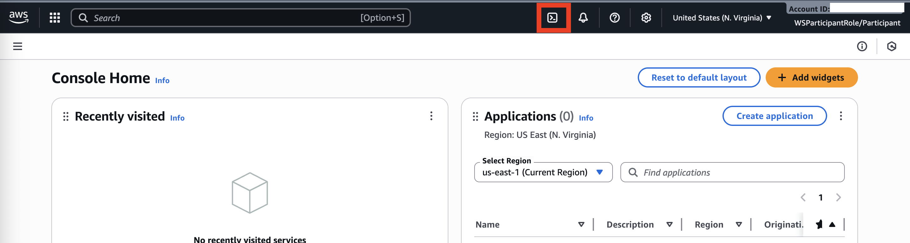

Code Server を利用するために必要な CloudFormation テンプレートをデプロイするスクリプトを準備しているので、AWS CloudShell が起動したら以下のコマンドを実行しましょう。

```bash
git clone https://github.com/littlemex/ec2-cfn-templates-for-genai.git
cd ec2-cfn-templates-for-genai/qdev
bash cfn_manager.sh create
```

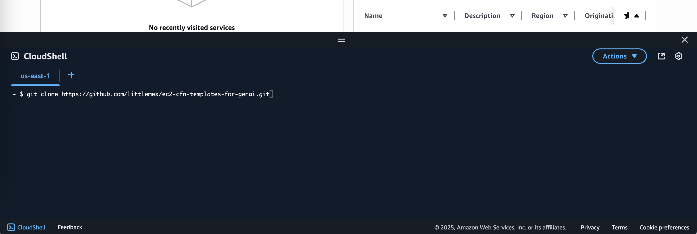

### Step 2: VS Code Server の接続情報取得

`create` を実行後に作成が完了するまでおよそ 10 分程度かかります。`monitor` を実行することで実行ステータスが確認でき、完了すると Code Server への接続情報が表示されます。

```bash
bash cfn_manager.sh monitor -n vscode-server-cloudshell-user -r us-east-1
```

**出力例:**
```
[SUCCESS] 🎯 Code Server準備完了!
[VSCODE] 🌐 Code Server URL:
https://xxxxx.cloudfront.net/?folder=/work

[INFO] 🔑 接続パスワード:
PNSrIHZ15TRwWc89(例)

[INFO] 💡 アクセス方法:
1. ブラウザでURLにアクセス
2. パスワード入力画面で上記パスワードを入力
```

完了まで時間がかかるため、その間に Amazon Q Developer の設定を終わらせてしまいましょう。

### Step 3: Amazon Q Developer の設定

[Amazon Q Developer のコンソール](https://us-east-1.console.aws.amazon.com/amazonq/developer/home?region=us-east-1)を開いて Q Developer 利用のための初期設定を行う必要があります。

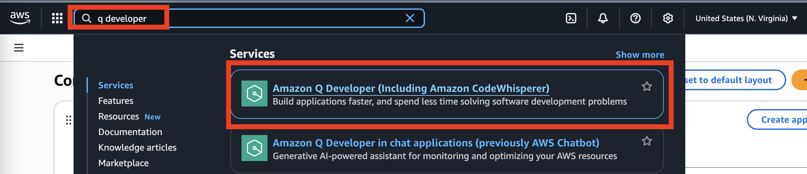

Amazon Q Developer のコンソールで `Get Started` をクリックしましょう。指示に従って操作することで自動的にユーザーと Identity Center のインスタンスなど Q Developer CLI 利用のために必要な一式の環境が作成されます。

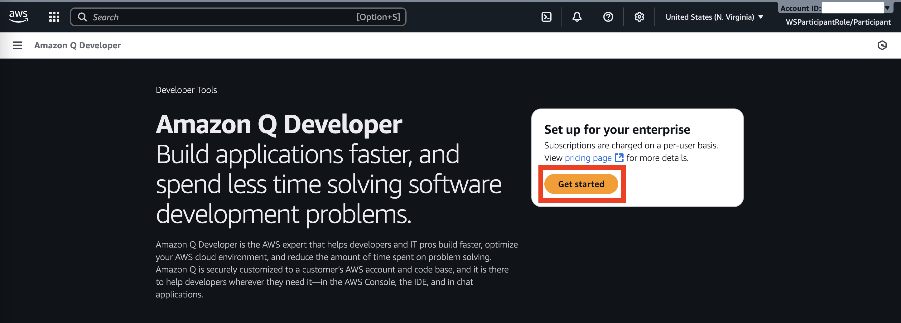

Create your user が表示されるので、Amazon Q Developer を利用するためのユーザーを作成します。ワンタイムパスワードを受信できる有効なメールアドレスを指定して、First/Last Name を記入して、`Continue` をクリックします。

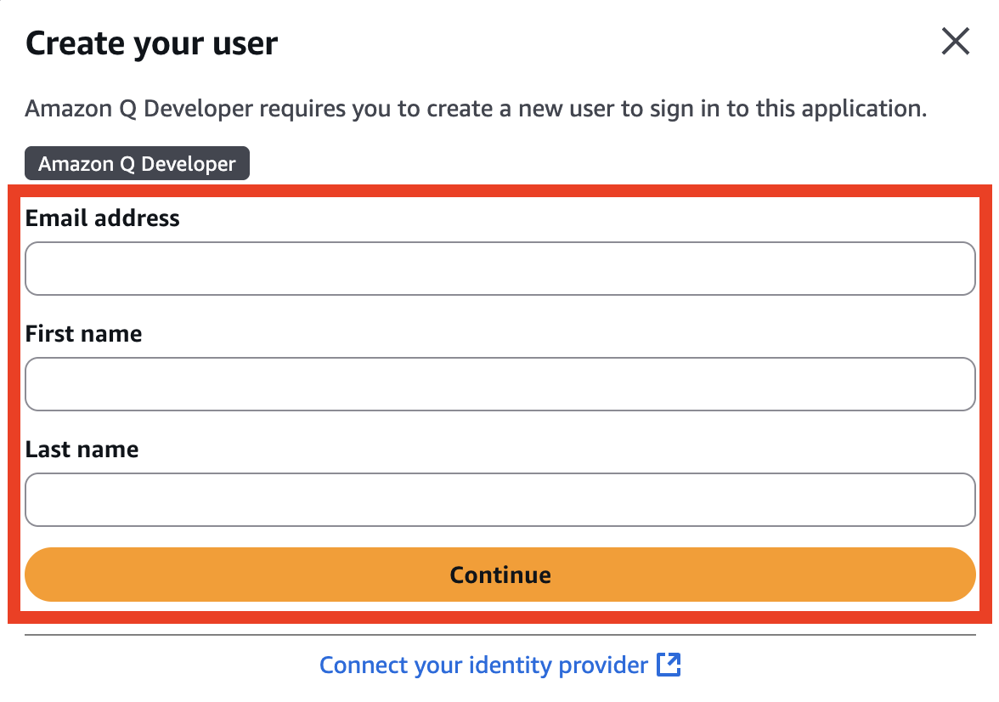

Amazon Q Developer の Profile を作成します。`Create` をクリックしましょう。

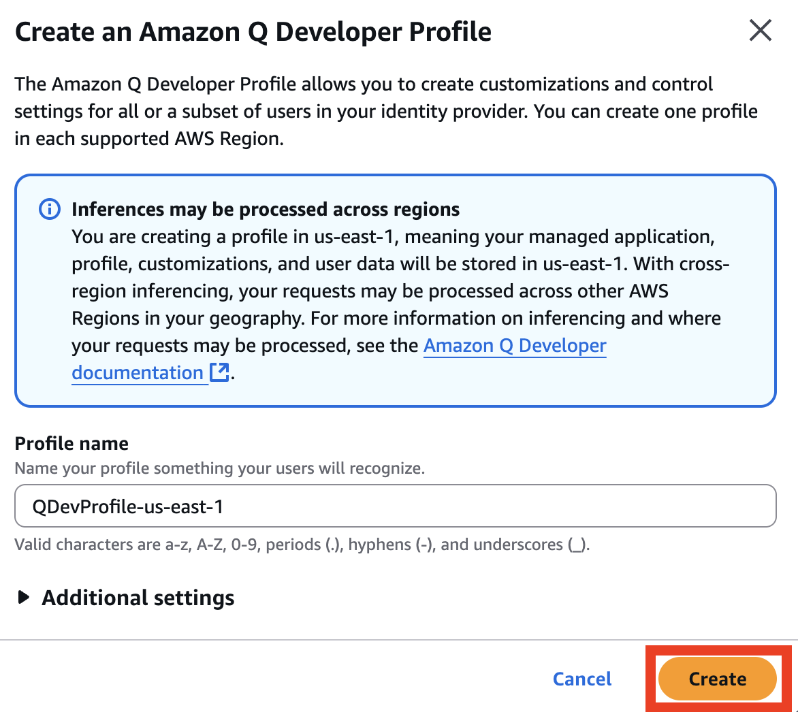

設定に問題がなければ正常に作成が完了されます。


数分で登録したメールアドレス宛に Invitaion メールが届きます。

### Step 4: ユーザーのサインアップ

指定したメールアドレスに届いた Invitation を確認しましょう。`Accept Invitation` をクリックします。

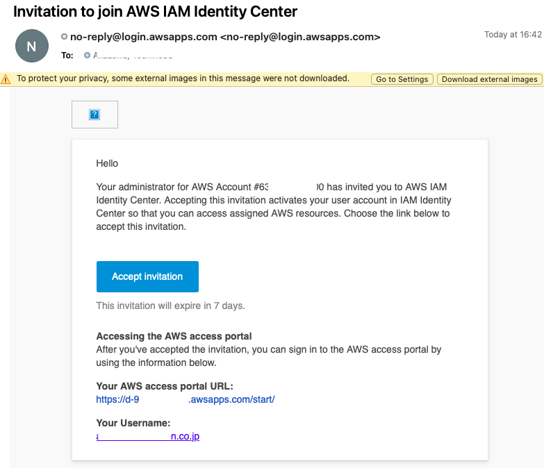

新規パスワードを入力し、`新しいパスワードを設定` をクリックします。

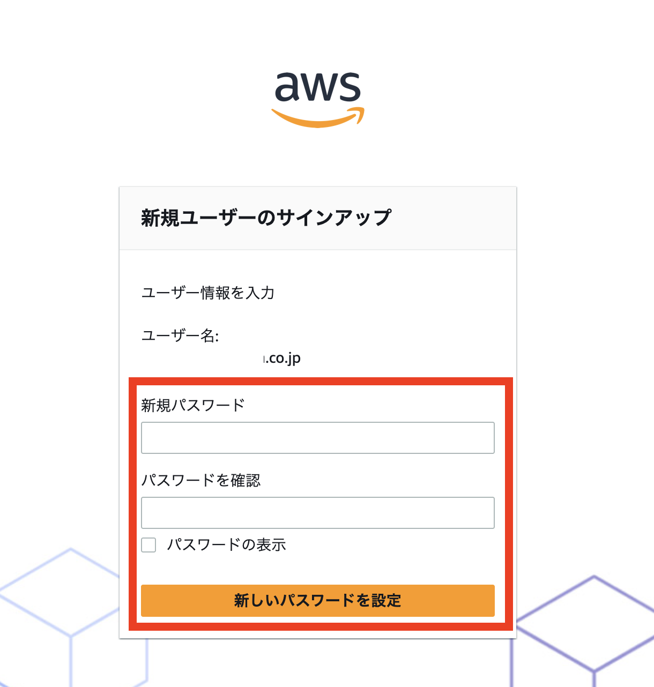

正常にユーザー作成が完了されるとログイン画面にリダイレクトされます。一旦 Step 4 の作業はここまでなのでログインは**必ず**後回しにして下さい。

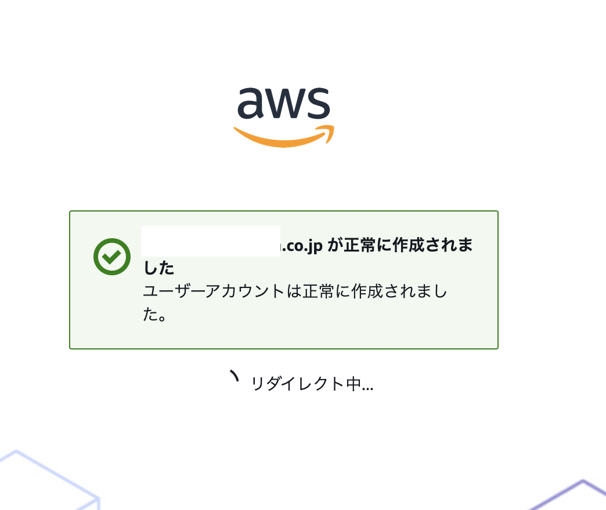

### Step 5: Code Server への接続

Amazon Q Developer とユーザーサインアップの作業をしている間に Code Server 作成が完了すると思われるので、Code Server URL を開いて Code Server にアクセスしましょう。ターミナルに URL と接続パスワードが表示されるのでこのパスワードを用いて接続して下さい。

**出力例:**
```
[SUCCESS] 🎯 Code Server準備完了!
[VSCODE] 🌐 Code Server URL:
https://xxxxx.cloudfront.net/?folder=/work

[INFO] 🔑 接続パスワード:
PNSrIHZ15TRwWc89(例)

[INFO] 💡 アクセス方法:
1. ブラウザでURLにアクセス
2. パスワード入力画面で上記パスワードを入力
```


Code Server の画面が開いたら、Amazon Q Developer CLI を利用するためにターミナルを開きます。

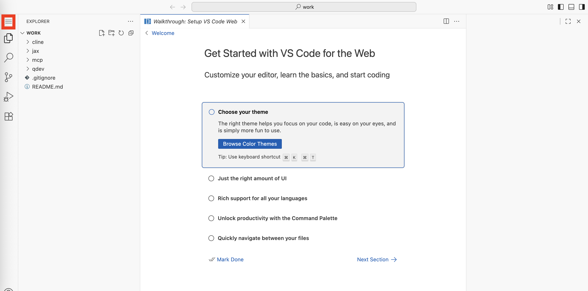

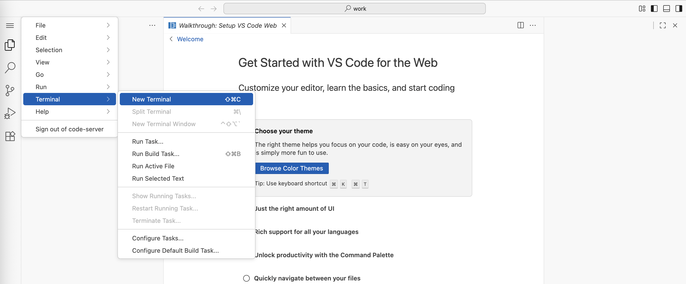

### Step 6: q login

すでに `q` コマンドは導入済みのため、`q login` で Amazon Q Developer CLI のログインを実行して利用可能な状態にしましょう。`q login` をするために必要な作業を楽にするためのスクリプト `q-login` を用意しているのでそれを実行しましょう。

```bash
cd qdev
./q-login
```

**!!!重要!!!**

スクリプトには検証環境で MFA を Disable するために、Disable 設定ページに遷移する処理が入っています。推奨される手順ではありませんが簡易に `q login` を一時的なアカウントで試す場合には MFA を Disable しても問題はないため、自己責任で Disable するかどうかを検討して下さい。`Do you want code-server to open the external website?` という確認画面が出てくるので `Open` をクリックすると設定のための AWS コンソールページが開かれます。

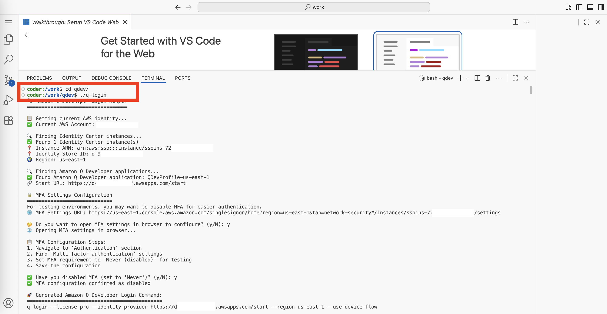

`🤔 Do you want to execute this command now? (y/N):` という確認で `y` を選択すると `q login` が実行され、サインインページが開かれます。


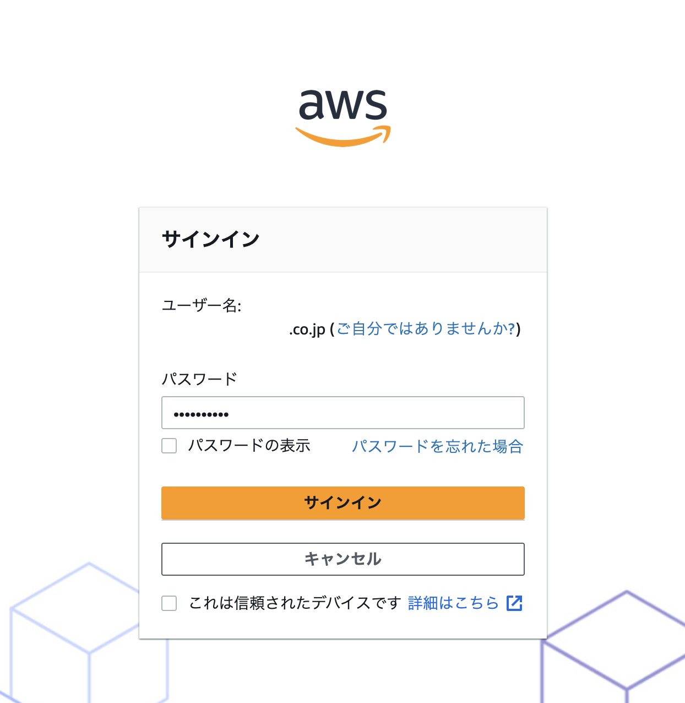

**重要: ここで MFA を Disable にしていない場合、MFA の設定画面が表示されます**

サインインがうまくいくと、認証リクエスト画面が表示されます。

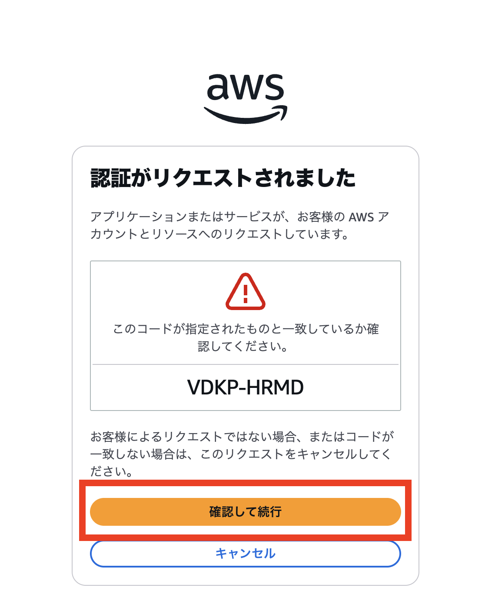

最後に Amazon Q Developer CLI へのデータアクセスの許可画面が出てくるので `アクセスを許可` をクリックします。

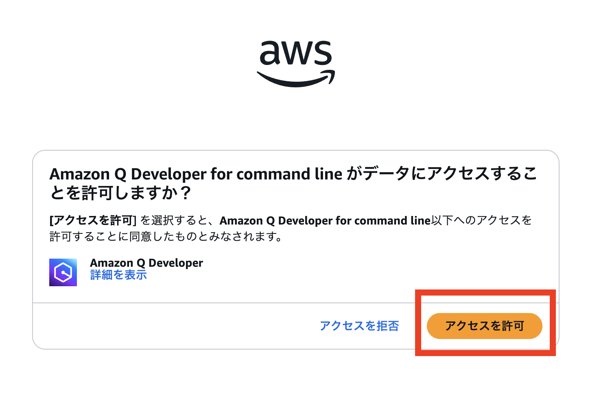

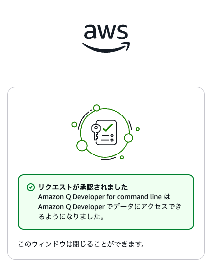

> コマンドの実行例:

```bash
./q-login 
🔍 Amazon Q Developer Login Helper
==================================

📋 Getting current AWS identity...
✅ Current AWS Account: xxxxx

🔍 Finding Identity Center instances...
✅ Found 1 Identity Center instance(s)
📍 Instance ARN: arn:aws:sso:::instance/ssoins-xxxxx
📍 Identity Store ID: d-xxxxx
🌍 Region: us-east-1

🔍 Finding Amazon Q Developer applications...
✅ Found Amazon Q Developer application: QDevProfile-us-east-1
🔗 Start URL: https://d-xxxxx.awsapps.com/start

🔒 MFA Settings Configuration
=============================
For testing environments, you may want to disable MFA for easier authentication.
🌐 MFA Settings URL: https://us-east-1.console.aws.amazon.com/singlesignon/home?region=us-east-1&tab=network-security#/instances/ssoins-xxxxx/settings

🤔 Do you want to open MFA settings in browser to configure? (y/N): y
🌐 Opening MFA settings in browser...

📋 MFA Configuration Steps:
1. Navigate to 'Authentication' section
2. Find 'Multi-factor authentication' settings
3. Set MFA requirement to 'Never (disabled)' for testing
4. Save the configuration

✅ Have you disabled MFA (set to 'Never')? (y/N): y
✅ MFA configuration confirmed as disabled

🚀 Generated Amazon Q Developer Login Command:
==============================================
q login --license pro --identity-provider https://d-xxxxx.awsapps.com/start --region us-east-1 --use-device-flow

📋 Command breakdown:
  --license pro: Use Amazon Q Developer Pro
  --identity-provider: Identity Center start URL
  --region: Identity Center region
  --use-device-flow: Use device flow for authentication

🤔 Do you want to execute this command now? (y/N): y
🚀 Executing login command...

? Enter Start URL › https://d-xxxxx.awsapps.com/startcoder:/work/qdev$ code q-login 
coder:/work/qdev$ ./q-login 
🔍 Amazon Q Developer Login Helper
==================================

📋 Getting current AWS identity...
✅ Current AWS Account: xxxxx

🔍 Finding Identity Center instances...
✅ Found 1 Identity Center instance(s)
📍 Instance ARN: arn:aws:sso:::instance/ssoins-xxxxx
📍 Identity Store ID: d-xxxxx
🌍 Region: us-east-1

🔍 Finding Amazon Q Developer applications...
✅ Found Amazon Q Developer application: QDevProfile-us-east-1
🔗 Start URL: https://d-xxxxx.awsapps.com/start

🔒 MFA Settings Configuration
=============================
For testing environments, you may want to disable MFA for easier authentication.
🌐 MFA Settings URL: https://us-east-1.console.aws.amazon.com/singlesignon/home?region=us-east-1&tab=network-security#/instances/ssoins-xxxxx/settings

🤔 Do you want to open MFA settings in browser to configure? (y/N): N
⚠️  Skipping MFA configuration - you may need to configure MFA settings manually if authentication fails
📋 Manual URL: https://us-east-1.console.aws.amazon.com/singlesignon/home?region=us-east-1&tab=network-security#/instances/ssoins-xxxxx/settings

🚀 Generated Amazon Q Developer Login Command:
==============================================
q login --license pro --identity-provider https://d-xxxxx.awsapps.com/start --region us-east-1 --use-device-flow

📋 Command breakdown:
  --license pro: Use Amazon Q Developer Pro
  --identity-provider: Identity Center start URL
  --region: Identity Center region
  --use-device-flow: Use device flow for authentication

🤔 Do you want to execute this command now? (y/N): y
🚀 Executing login command...

✔ Enter Start URL · https://d-xxxxx.awsapps.com/start
✔ Enter Region · us-east-1

Confirm the following code in the browser
Code: VDKP-HRMD

Device authorized

Logged in successfully
```

**MFA 設定ページ**

MFA の設定ページの画面を示します。Multi-factor authentication > `Configure` をクリックします。

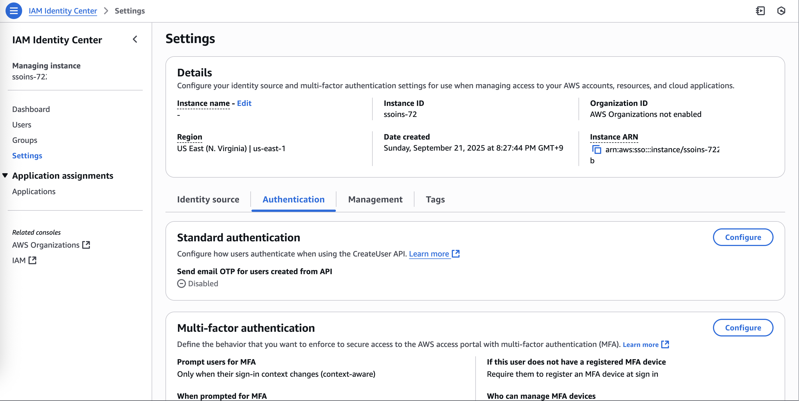

## 🎉 Step 7: q chat

`Logged in successfully` が表示されればめでたくログイン成功です！

`q chat` を実行して正常に Amazon Q Developer CLI が動作するか確認してみましょう。

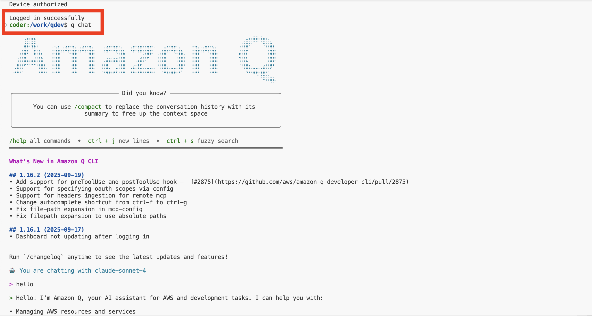

これで Amazon Q Developer CLI のセットアップが完了しました！

## 📚 便利なコマンド

VS Code Server 管理
```bash
# SSM で EC2 に接続
bash cfn_manager.sh connect -n vscode-server-cloudshell-user

# スタック削除
bash cfn_manager.sh delete -n vscode-server-cloudshell-user
```

### Amazon Q Developer CLI
```bash
# ログイン状態確認
q whoami

# プロファイル確認
q profile

# チャット開始
q chat

# ログアウト
q logout
```