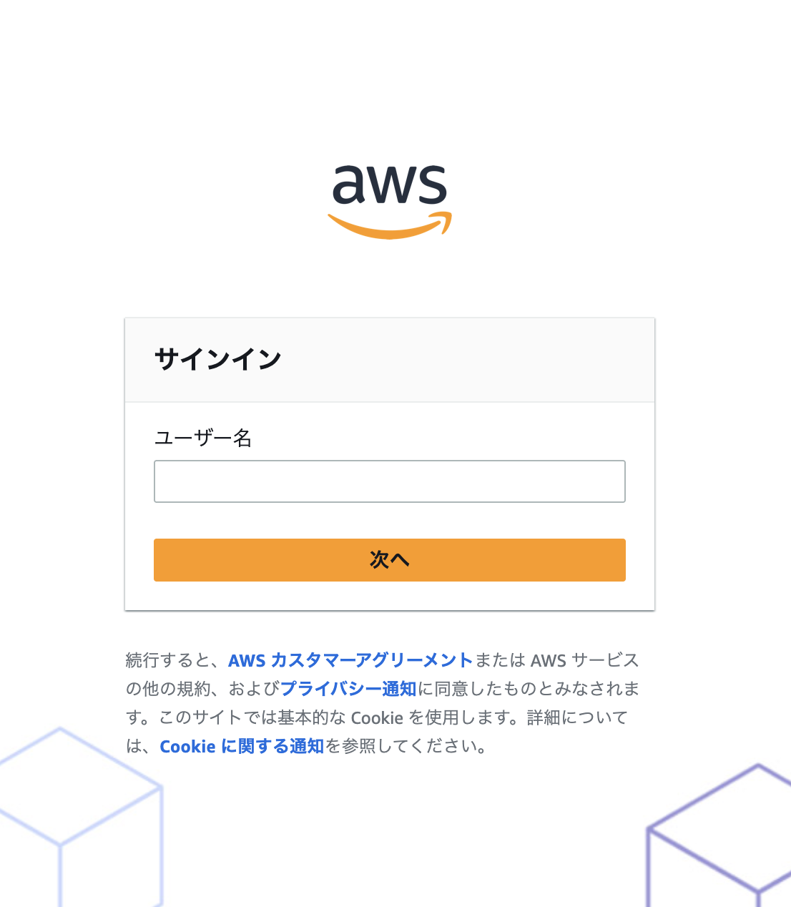

# Amazon Q Developer for CLI 初心者向けセットアップガイド

このガイドでは、プログラミング経験がほとんどない方でも Amazon Q Developer for CLI を使えるようになるまでの手順を、画面の写真付きで詳しく説明します。

## 🤔 Amazon Q Developer for CLI とは？

Amazon Q Developer for CLI は、Amazon が提供する AI アシスタントです。コマンドライン（文字で指示を出す画面）を使って、プログラミングの質問をしたり、コードの説明を聞いたりできます。

## 📋 始める前に必要なもの

- **AWS アカウント** AWS のクラウドサービスを使うためのアカウント（無料で作成可能）
- **インターネット接続**：安定したインターネット環境
- **メールアドレス**：認証コードを受信するため
- **ウェブブラウザ**：Chrome、Firefox、Safari など

## 🚀 セットアップの流れ

全体の作業は以下の 7 つのステップに分かれています：

1. **作業環境の作成**：クラウド上にプログラミング環境を準備
2. **作業環境の接続情報取得**：作成した環境にアクセスするための情報を取得
3. **Amazon Q Developer の初期設定**：AI アシスタントを使うための準備
4. **ユーザー登録**：あなた専用のアカウントを作成
5. **作業環境への接続**：実際に作業する画面にアクセス
6. **AI アシスタントへのログイン**：Amazon Q Developer for CLI を使えるようにする
7. **動作確認**：正しく設定できたかテスト

所要時間：約 30 分（待ち時間含む）

---

## Step 1: 作業環境の作成

### AWS CloudShell とは？
AWS CloudShell は、AWS コンソール上で使えるコマンドライン環境です。自分のパソコンに何もインストールしなくても、CLI（コマンドラインインタフェース）操作ができます。

### Code Server（クラウド IDE）とは？
このステップで作成する Code Server は、ブラウザからアクセスできるクラウド IDE（統合開発環境）です。IDE とは、プログラマーがコードを書いたり、実行したり、デバッグしたりするための総合的なツールのことです。

**Code Server の特徴：**
- **ブラウザベース**：インターネットがあればどこからでもアクセス可能
- **ターミナル統合**：コマンドライン操作とコード編集を同じ画面で実行
- **拡張機能対応**：プログラミング言語ごとの専用ツールを追加可能
- **ファイル管理**：プロジェクトのファイルやフォルダを整理・管理

### 手順

1. **AWS コンソールにログイン**
   - [AWS コンソール](https://console.aws.amazon.com/) にアクセス
   - あなたの AWS アカウントでログイン

2. **CloudShell を開く**
   - 画面上部の検索バーに「CloudShell」と入力
   - 「CloudShell」をクリック
   
   

3. **必要なファイルをダウンロード**
   
   CloudShell の画面が開いたら、以下のコマンドを **一行ずつ** 入力してください。コマンドを入力したら「Enter」キーを押します。

   ```bash
   git clone https://github.com/littlemex/ec2-cfn-templates-for-genai.git
   ```
   
   このコマンドは、必要なファイルをインターネットからダウンロードします。

4. **フォルダに移動**
   
   ```bash
   cd ec2-cfn-templates-for-genai/coding-agents
   ```
   
   このコマンドは、ダウンロードしたファイルがあるフォルダに移動します。

5. **作業環境を作成**
   
   ```bash
   bash cfn_manager.sh create
   ```
   
   このコマンドは、あなた専用のプログラミング環境をクラウド上に作成します。

   

**💡 ポイント**
- コマンドは必ず一行ずつ入力してください
- 大文字・小文字、スペースも正確に入力してください
- エラーが出た場合は、入力内容を確認してもう一度試してください

---

## Step 2: 作業環境の接続情報取得

### なぜこのステップが必要？
Step 1 で作業環境の作成を開始しましたが、完成まで約 10 分かかります。このステップでは、作成が完了したかを確認し、完成したら接続に必要な情報（URL とパスワード）を取得します。

### 手順

1. **作成状況を確認**
   
   以下のコマンドを入力してください：
   
   ```bash
   bash cfn_manager.sh monitor -n vscode-server-cloudshell-user -r us-east-1
   ```

2. **完成を待つ**
   
   このコマンドを実行すると、作成の進行状況が表示されます。「作成中...」のような表示が出ている間は、完成まで待ちましょう。

3. **接続情報の確認**
   
   作成が完了すると、以下のような情報が表示されます：

   ```
   [SUCCESS] 🎯 Code Server準備完了!
   [VSCODE] 🌐 Code Server URL:
   https://xxxxx.cloudfront.net/?folder=/work
   [INFO] 🔑 接続パスワード:
   PNSrIHZ15TRwWc89(例)
   [INFO] 💡 アクセス方法:
   1. ブラウザでURLにアクセス
   2. パスワード入力画面で上記パスワードを入力
   ```

4. **情報をメモ**
   
   - **URL**（https://で始まる長い文字列）をコピーしてメモ帳などに保存
   - **パスワード**（英数字の組み合わせ）もメモ帳に保存

**💡 ポイント**
- この情報は後で使うので、必ずメモしておいてください
- URL とパスワードは毎回異なります
- 作成には時間がかかるので、次のステップを並行して進めましょう

---

## Step 3: Amazon Q Developer の初期設定

### Amazon Q Developer とは？
Amazon Q Developer は、プログラミングに関する質問に答えてくれる AI アシスタントです。このステップでは、その AI アシスタントを使うための初期設定を行います。

### 手順

1. **Amazon Q Developer コンソールを開く**
   
   新しいブラウザタブで [Amazon Q Developer コンソール](https://us-east-1.console.aws.amazon.com/amazonq/developer/home?region=us-east-1) にアクセスしてください。

   

2. **初期設定を開始**
   
   画面に表示される「Get Started」ボタンをクリックしてください。

   

3. **ユーザー情報を入力**
   
   「Create your user」画面が表示されます：
   
   - **Email address**：認証コードを受信できるメールアドレスを入力
   - **First name**：あなたの名前（例：太郎）
   - **Last name**：あなたの苗字（例：山田）
   
   入力が完了したら「Continue」をクリックしてください。

   

4. **プロファイル作成**
   
   「Create」ボタンをクリックして、Amazon Q Developer のプロファイルを作成してください。

   

5. **設定完了の確認**
   
   正常に設定が完了すると、成功画面が表示されます。

   

**💡 ポイント**
- メールアドレスは必ず受信可能なものを使用してください
- 数分後に招待メールが届きます
- この画面は開いたままにしておいてください

---

## Step 4: ユーザー登録の完了

### このステップの目的
Step 3 で入力したメールアドレスに招待メールが届きます。そのメールを使って、あなた専用のアカウントを完成させます。

### 手順

1. **招待メールを確認**
   
   Step 3 で入力したメールアドレスの受信箱を確認してください。「Amazon Q Developer への招待」のようなタイトルのメールが届いているはずです。

2. **招待を受諾**
   
   メール内の「Accept Invitation」ボタンをクリックしてください。

   

3. **パスワードを設定**
   
   新しいパスワードを入力する画面が表示されます：
   
   - 8 文字以上で、大文字・小文字・数字を含むパスワードを入力
   - 確認のため、同じパスワードをもう一度入力
   - 「新しいパスワードを設定」をクリック

   

4. **登録完了の確認**
   
   ユーザー登録が完了すると、ログイン画面が表示されます。

   

**⚠️ 重要**
- この時点ではまだログインしないでください
- ログイン画面が表示されたら、そのタブは閉じて構いません
- パスワードは忘れないようにメモしておいてください

---

## Step 5: 作業環境への接続

### このステップの目的
Step 1 で作成した作業環境（Code Server）に実際にアクセスして、プログラミングができる画面を開きます。

### 手順

1. **Step 2 の情報を確認**
   
   Step 2 でメモした以下の情報を準備してください：
   - Code Server の URL
   - 接続パスワード

2. **Code Server にアクセス**
   
   新しいブラウザタブを開いて、メモした URL にアクセスしてください。

3. **パスワードを入力**
   
   パスワード入力画面が表示されるので、メモした接続パスワードを入力してください。

   

4. **Code Server 画面の確認**
   
   正しいパスワードを入力すると、Visual Studio Code のような画面が表示されます。これが Code Server です。

   

   **Code Server の画面構成：**
   - **左側のサイドバー**：ファイルやフォルダの一覧が表示される
   - **中央のエディタ**：コードを書いたり編集したりする場所
   - **下部のターミナル**：コマンドラインで指示を出す場所（これから開きます）
   - **上部のメニューバー**：ファイル操作や設定を行う場所

5. **ターミナルを開く**
   
   画面上部のメニューから「Terminal」→「New Terminal」をクリックしてください。

   

   ターミナルが開くと、`coder:/work/$` のような文字が出てきます。ここにカーソルを当てると文字を入力でき、エンジニアはこのターミナルで様々なコード開発作業を行います。ターミナルを体感するために `apt-get moo` と打ち込んでみましょう。何が起きましたか？

**💡 ポイント**
- **Code Server** は、プロのエンジニアが使う本格的なプログラミング環境をブラウザで再現したものです
- **ターミナル** は、コンピューターに文字で指示を出すための画面で、Amazon Q Developer for CLI もここで使います
- **コード編集** と **コマンド実行** を同じ画面で行えるため、効率的にプログラミング作業ができます
- この環境では、ファイルの作成・編集・保存、プログラムの実行、デバッグなど、プログラミングに必要なすべての作業が可能です

---

## Step 6: Amazon Q Developer for CLI へのログイン

### このステップの目的
作業環境で Amazon Q Developer for CLI を使えるようにするため、先ほど作成したアカウントでログインします。

### 手順

1. **作業フォルダに移動**
   
   ターミナル（黒い画面）に以下のコマンドを入力してください：
   
   ```bash
   cd coding-agents
   ```

2. **ログイン支援スクリプトを実行**
   
   以下のコマンドを入力してください：
   
   ```bash
   ./q-login
   ```

3. **質問に答える**
   
   スクリプトが実行されると、いくつか質問されます。基本的に「y」と入力して「Enter」を押してください。

   ```
   🤔 Do you want to open MFA settings in browser to configure? (y/N): y
   ```
   
   「y」と入力して「Enter」すると、AWS コンソールが開きます。

   検証アカウントでは作業ステップが増えるため MFA を無効化します。（検証アカウント以外では無効化しないでください）
   
   「Configure」→ 「Never」→ 「Save Changes」の順でボタンを押して無効化しましょう。

   

   

   

   ```
   ✅ Have you disabled MFA (set to 'Never')? (y/N): y
   ```
   
   「y」と入力して「Enter」

   ```
   🤔 Do you want to execute this command now? (y/N): y
   ```
   
   「y」と入力して「Enter」

4. **ブラウザでの認証**
   
   「Do you want code-server to open the external website?」という確認が出たら「Open」をクリックしてください。

   

5. **ログイン情報を入力**
   
   新しいタブでログイン画面が開きます：
   
   - **ユーザー名**：Step 3 で入力したメールアドレス
   - **パスワード**：Step 4 で設定したパスワード

   
   

6. **認証リクエストを承認**
   
   ログインが成功すると、認証リクエスト画面が表示されます。内容を確認して承認してください。

   

7. **データアクセスを許可**
   
   最後に「アクセスを許可」をクリックしてください。

   
   

**💡 ポイント**
- MFA（多要素認証）は、セキュリティを高める仕組みですが、今回は学習目的のため無効にします
- 本番環境では MFA を有効にすることを推奨します
- ログインに成功すると「Logged in successfully」と表示されます

---

## Step 7: 動作確認

### このステップの目的
Amazon Q Developer for CLI が正しく設定されているかを確認し、実際に AI アシスタントと会話してみます。

### 手順

1. **ログイン成功の確認**
   
   ターミナルに「Logged in successfully」と表示されていることを確認してください。

2. **チャット機能を試す**
   
   以下のコマンドを入力してください：
   
   ```bash
   q chat
   ```

3. **AI アシスタントと会話**
   
   チャット画面が開いたら、試しに以下のような質問をしてみてください：
   
   - 「こんにちは」
   - 「Python とは何ですか？」
   - 「簡単なプログラムの例を教えてください」

   

4. **チャットの終了**
   
   チャットを終了するには、「Ctrl + C」キーを同時に押してください。

エージェンティック AI アシスタントと会話できましたか？

できましたね？

**🎉 おめでとうございます！**

これで Amazon Q Developer for CLI のセットアップが完了しました。AI アシスタントと自由に会話して、プログラミングについて学んでください。

---

**以降は手順ではなく補足情報なので読む必要はありません。**

## 📚 覚えておくと便利なコマンド

### Amazon Q Developer for CLI の基本コマンド

```bash
# 現在のログイン状態を確認
q whoami

# プロファイル情報を確認
q profile

# AI アシスタントとチャット
q chat

# ログアウト
q logout
```

### 作業環境の管理

```bash
# 作業環境に直接接続（上級者向け）
bash cfn_manager.sh connect -n vscode-server-cloudshell-user

# 作業環境を削除（使い終わったら）
bash cfn_manager.sh delete -n vscode-server-cloudshell-user
```

## 🔧 トラブルシューティング

### よくある問題と解決方法

**Q: コマンドを入力してもエラーが出る**
A: 以下を確認してください：
- コマンドの入力に間違いがないか
- 大文字・小文字が正確か
- 余分なスペースが入っていないか

**Q: メールが届かない**
A: 以下を確認してください：
- 迷惑メールフォルダを確認
- メールアドレスの入力間違いがないか
- 数分待ってから再確認

**Q: パスワードを忘れた**
A: AWS コンソールから Identity Center にアクセスして、パスワードリセットを行ってください。

**Q: 作業環境にアクセスできない**
A: 以下を確認してください：
- URL が正確にコピーされているか
- パスワードが正確に入力されているか
- ブラウザのキャッシュをクリアしてみる