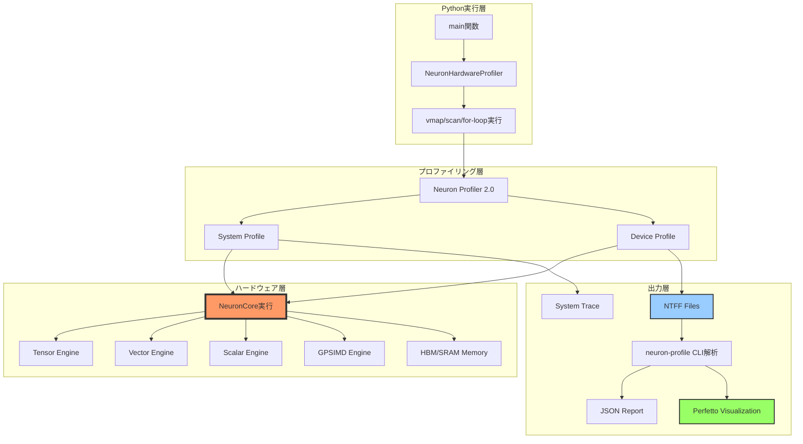
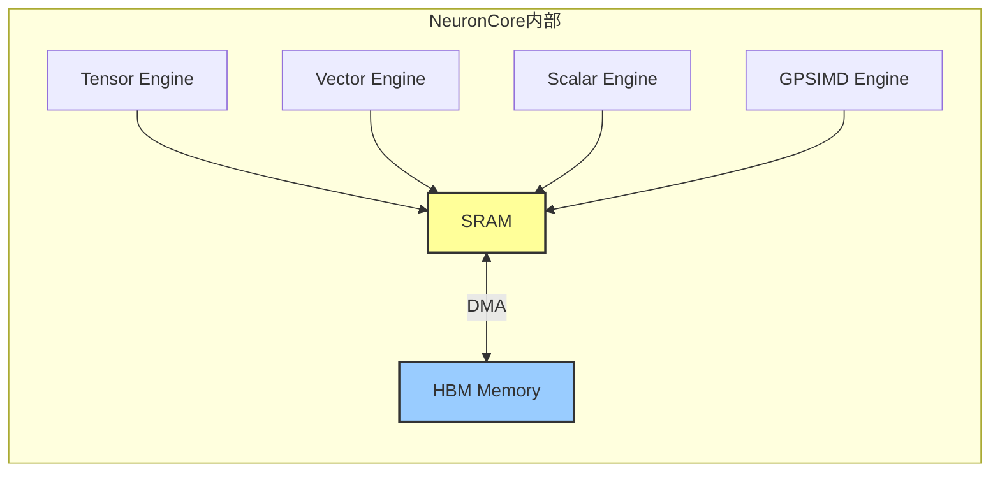
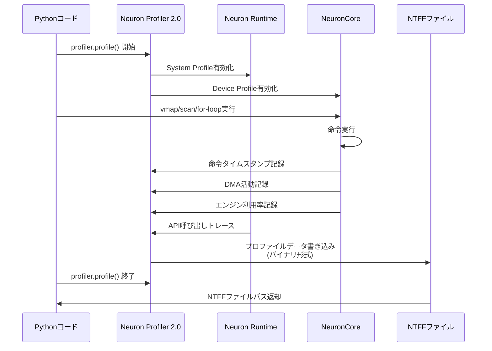
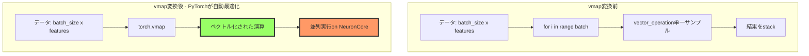
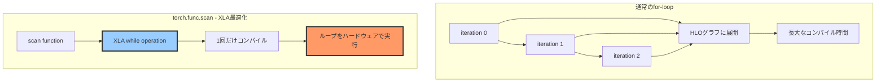
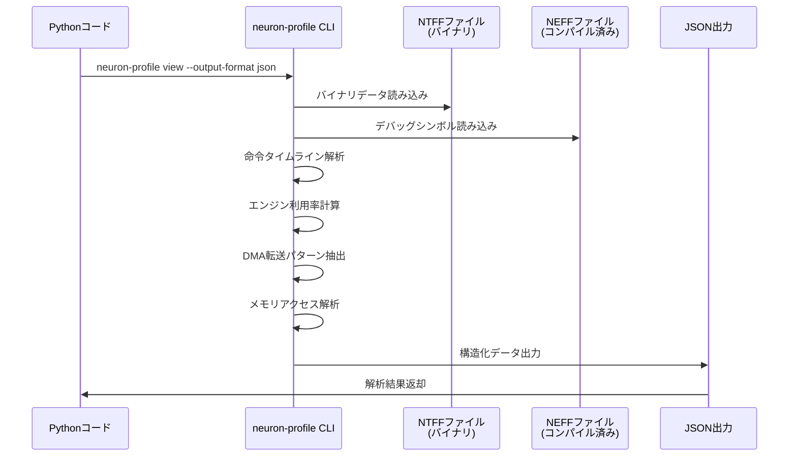
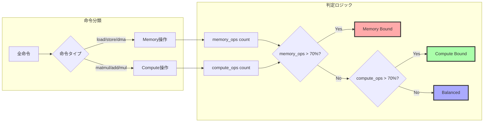
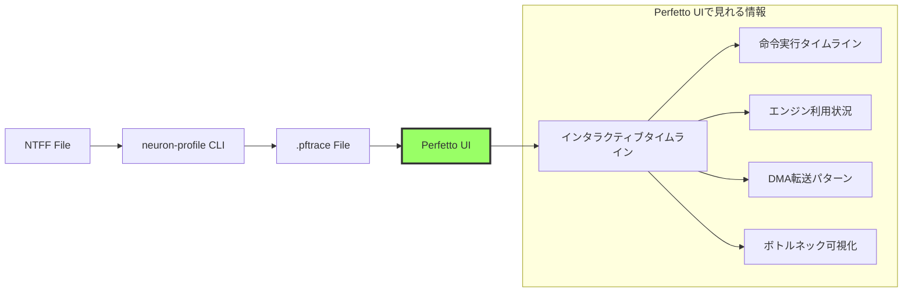
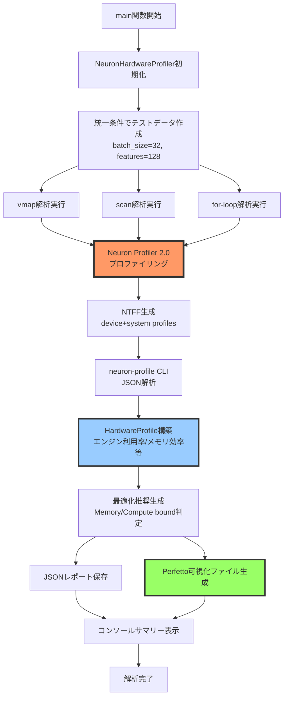

# AWS Neuron Hardware Deep Analysis

本資料はNeuronのパフォーマンスをプロファイルするためのノウハウについて整理します。

## 🚀 クイックスタートガイド

### Step 1: ハードウェア解析スクリプト実行

```bash
# パッケージを追加するために chown してください。不足するパッケージがある場合は追加してください。
sudo chown -R $USER:$USER /opt/aws_neuronx_venv_pytorch_2_8/lib/python3.10/site-packages/

source /opt/aws_neuronx_venv_pytorch_2_8/bin/activate
cd pytorch-neuron
python scripts/neuron_hardware_deep_analyzer.py
```

実行結果として、pftraceという拡張子でNeuron Profilerのプロファイル結果のファイルが生成されます。
`/tmp/neuron_hardware_profiles_comprehensive_hardware_deep_analysis/perfetto_pattern_mapping.json` に生成されたファイル情報があり、
次のステップではこのファイルを元に pftrace のパスを理解します。

```bash
...
🎨 Perfetto analysis files:
   • /tmp/neuron_hardware_profiles_comprehensive_hardware_deep_analysis/vmap_hardware_deep_hardware.pftrace
   • /tmp/neuron_hardware_profiles_comprehensive_hardware_deep_analysis/scan_hardware_deep_hardware.pftrace
   • /tmp/neuron_hardware_profiles_comprehensive_hardware_deep_analysis/for_loop_hardware_small_hardware.pftrace
   • /tmp/neuron_hardware_profiles_comprehensive_hardware_deep_analysis/for_loop_hardware_medium_hardware.pftrace
   • /tmp/neuron_hardware_profiles_comprehensive_hardware_deep_analysis/for_loop_hardware_large_hardware.pftrace
   → View at: https://ui.perfetto.dev/
```

### Step 2: Perfettoトレース分析

Step 1 で生成された `perfetto_pattern_mapping.json` ファイルを元に pftrace を解析します。

```bash
uv run scripts/perfetto_analyzer.py
```

実行結果として、pftraceに対するSQLクエリでの解析結果がjsonとして保存されます。自身でクエリを修正して多様な分析をしてもらえます。
prefetto-mcp ディレクトリを利用すると prefetto の SQL を自動生成して利用するMCPを構築できます。
`scrips/setup_perfetto_mcp.sh`に一例としてClineにMCPを設定するスクリプトを用意しました。ご自身のコーディングエージェントに合わせてMCP設定すれば動きます。

```bash
...
💾 Results saved to: /tmp/neuron_hardware_profiles_comprehensive_hardware_deep_analysis/vmap_hardware_deep_hardware.pftrace_analysis_comprehensive.json
```

## 手元の実行結果

vmapはTensorMatrix Engine、つまりシストリックアレイを最も効果的に利用している。
小規模な構造ではあまりforとの差分は見えてこないが大規模な構造になると性能差が現れてくると思われる。
scanはvmapに次いでシストリックアレイの利用効率が良く実利用時にも問題なく利用できると思われる。
あくまで今回の計測結果での状況であり実際の実行時間は実装やハードウェアの構成等によって大きく異なると思われるため基本的にはプロファイラを用いた計測を実コードに合わせて実施することが望まれる。

```bash
STATISTICAL FINDINGS:
  vmap: Other操作 15回, 0.000794ms
  vmap: TensorMatrix操作 5回, 0.001ms
  scan: WRITE操作 33回, Other操作時間 0.002ms
  for-loop: unknown操作範囲 64-1299個
  for-loop scaling: for_loop_small(1117slices) to for_loop_large(10223slices)

STATISTICAL INSIGHTS:
  Analysis condition: all patterns use 3 iterations x 32 batch x 128 features
  Fastest pattern: vmap (total engine time: 0.002ms)
  Slowest pattern: for_loop_large (total engine time: 0.128ms)
  Time difference: 0.126ms, Ratio: 56.8x (calculation: 0.128 / 0.002)
  vmap: TensorMatrix ratio 64.8% (calculation: 0.001 / 0.002 * 100)
  scan: TensorMatrix ratio 45.8% (calculation: 0.002 / 0.004 * 100)
  for_loop_small: TensorMatrix ratio 43.4% (calculation: 0.002 / 0.004 * 100)
  for_loop_medium: TensorMatrix ratio 15.2% (calculation: 0.006 / 0.038 * 100)
  for_loop_large: TensorMatrix ratio 13.4% (calculation: 0.017 / 0.128 * 100)

DATA COMPARISON METRICS TABLE:
Pattern              Total Slices TensorMatrix ms Other ms   Rank  
--------------------------------------------------------------------
vmap                 877          0.001           0.001      5     
scan                 1009         0.002           0.002      3     
for_loop_small       1117         0.002           0.002      4     
for_loop_medium      3401         0.006           0.032      2     
for_loop_large       10223        0.017           0.111      1     
```

# AWS Neuron Hardware Deep Analyzer

AWS Neuron Profiler 2.0とPyTorch/XLAの技術調査を踏まえて、コードの詳細を説明します。

## 🎯 このコードの目的

AWS Neuron（機械学習専用ハードウェア）上で、**3つの並列処理パターンのハードウェアレベルでの挙動を比較**します。

1. **vmap** - PyTorchのベクトル化マップ（並列バッチ処理）
2. **scan** - 順次処理の最適化（XLA whileオペレーション）
3. **for-loop** - 通常のPythonループ

## 📊 全体アーキテクチャ



## 🔬 コードブロック詳細解説

### 1️⃣ **データクラス: HardwareProfile**

```python
@dataclass
class HardwareProfile:
    pattern_name: str
    
    # Compute Engine分析
    tensor_engine_utilization: float
    vector_engine_utilization: float
    scalar_engine_utilization: float
    gpsimd_engine_utilization: float
    engine_overlap_efficiency: float
    
    # Memory Architecture分析
    hbm_bandwidth_utilization: float
    sram_usage_efficiency: float
    dma_transfer_count: int
    memory_bound_score: float
    
    # ... (省略)
```

**目的**: AWS Neuronハードウェアの詳細メトリクスを構造化

**重要な概念**:

- **Compute Engines**: 
  - **Tensor Engine**: 行列演算専用（MATMUL等）
  - **Vector Engine**: ベクトル演算（要素ごとの加算、ReLU等）
  - **Scalar Engine**: スカラー演算（定数加算等）
  - **GPSIMD Engine**: 汎用SIMD演算

- **Memory Architecture**:
  - **HBM (High Bandwidth Memory)**: 外部高速メモリ
  - **SRAM**: オンチップキャッシュ
  - **DMA Transfer**: HBM↔SRAM間のデータ転送



---

### 2️⃣ **NeuronHardwareProfiler クラス - 初期化**

```python
class NeuronHardwareProfiler:
    UNIFIED_CONDITIONS = {
        'iterations': 3,           # すべてのパターンで3回処理
        'batch_size': 32,         # バッチサイズ32
        'feature_size': 128,      # 特徴次元128
        'model_type': 'small'     # smallモデル使用
    }
```

**重要ポイント**: **統一条件（UNIFIED_CONDITIONS）**により、vmap/scan/for-loopの**公平な比較**を保証

**なぜ統一条件が必要か**:
- バッチサイズやループ回数が異なると、ハードウェア利用率が大きく変わる
- 同じ条件で比較しないと、パターン間の本質的な差が見えない

```python
def __init__(self, analysis_name: str = "hardware_deep_analysis"):
    self.device = torch_xla.device()  # XLAデバイス取得
    self.profile_output_dir = Path(f"/tmp/neuron_hardware_profiles_{analysis_name}")
    
    # パターン名とプロファイルファイルのマッピング追跡
    self.pattern_profile_mapping = {}
    self.profile_execution_order = []
    
    # Neuron Profiler 2.0環境設定
    os.environ['NEURON_RT_INSPECT_OUTPUT_DIR'] = str(self.profile_output_dir)
```

**マッピング追跡の理由**: Neuron Profilerは複数のNTFFファイルを生成するため、どのファイルがどのパターンに対応するか記録が必要

### 3️⃣ **プロファイリングコンテキスト**

```python
@contextmanager
def hardware_profiling_context(self, pattern_name: str):
    """ハードウェアプロファイリングコンテキスト"""
    before_files = set(self.profile_output_dir.glob("**/*.ntff"))
    
    try:
        # Neuron Profiler 2.0: System + Device profiles
        with profiler.profile(
            port=9012,
            profile_type='system',  # システムレベルプロファイル
            target='neuron_profile_perfetto',  # Perfetto統合
            output_dir=str(self.profile_output_dir),
            ms_duration=30000  # 30秒間キャプチャ
        ) as prof:
            os.environ['NEURON_RT_INSPECT_DEVICE_PROFILE'] = '1'
            yield prof
    finally:
        # 生成されたNTFFファイルをパターン名とマッピング
        after_files = set(self.profile_output_dir.glob("**/*.ntff"))
        new_files = after_files - before_files
        
        for ntff_file in new_files:
            self.pattern_profile_mapping[str(ntff_file)] = pattern_name
            self.profile_execution_order.append((pattern_name, str(ntff_file)))
```

**Neuron Profiler 2.0の仕組み**:



**NTFF (Neuron Trace File Format)** とは

- バイナリ形式のプロファイルデータ
- 命令レベルのタイムライン（ナノ秒精度）
- DMA転送パターン
- エンジン利用状況
- メモリアクセスパターン

---

### 4️⃣ **vmap ハードウェア解析**

```python
def analyze_vmap_hardware_behavior(self, data: torch.Tensor) -> HardwareProfile:
    """vmap内部ハードウェア挙動解析（統一条件）"""
    
    with self.hardware_profiling_context("vmap_hardware_deep"):
        def vector_operation(x):
            # 複数の演算を組み合わせてハードウェア利用を観察
            result = torch.sum(x * x, dim=-1)  # Tensor Engine
            result = torch.relu(result)        # Vector Engine  
            result = result + 0.1              # Scalar Engine
            return result
            
        # 統一条件：3回のバッチ処理
        batch_input = data.unsqueeze(0).repeat(self.UNIFIED_CONDITIONS['iterations'], 1, 1)
        vmapped_result = torch.vmap(vector_operation)(batch_input)
        torch_xla.sync()
```

**vmapの動作原理**



**vmapの特徴**

- **自動ベクトル化**: for-loopをPyTorch内部で並列化
- **バッチディメンション処理**: 明示的なループなしでバッチ処理
- **ハードウェア最適化**: NeuronCore上で効率的に並列実行

### 5️⃣ **scan ハードウェア解析**

```python
def analyze_scan_hardware_behavior(self, data: torch.Tensor) -> HardwareProfile:
    """scan内部ハードウェア挙動解析（統一条件）"""
    
    with self.hardware_profiling_context("scan_hardware_deep"):
        if TORCH_FUNC_AVAILABLE:
            def scan_function(carry, x):
                # Sequential computationのハードウェアパターン観察
                new_carry = carry + torch.sum(x)  # Memory access pattern
                intermediate = torch.matmul(x, x.T)  # Tensor Engine utilization
                return new_carry, new_carry + torch.sum(intermediate)
            
            init_carry = torch.tensor(0.0, device=self.device)
            # 統一条件：3回の順次処理
            scan_inputs = data.unsqueeze(0).repeat(self.UNIFIED_CONDITIONS['iterations'], 1, 1)
            final_carry, outputs = torch.func.scan(scan_function, init_carry, scan_inputs)
        
        torch_xla.sync()
```

**scanの動作原理**



**scanの特徴**

- **XLA while operation**: ループ自体がコンパイラの一級オブジェクト
- **コンパイル時間短縮**: 1回の反復だけコンパイル、残りは実行時にループ
- **状態の持ち越し**: `carry`で反復間で状態を効率的に伝搬

# AWS Neuron Hardware Deep Analyzer

## 6️⃣ **for-loop ハードウェア解析**

```python
def analyze_for_loop_hardware_behavior(self, data: torch.Tensor, loop_size: str = "medium") -> HardwareProfile:
    """for-loop内部ハードウェア挙動解析（統一条件・TEN404エラー回避版）"""
    
    try:
        with self.hardware_profiling_context(f"for_loop_hardware_{loop_size}"):
            # TEN404回避のため単純化したloop構造（統一条件使用）
            result = torch.zeros(data.size(1), device=self.device)
            
            # 統一条件：3回のループ処理
            for i in range(self.UNIFIED_CONDITIONS['iterations']):
                # 単純化されたoperations（TEN404回避）
                idx = i % data.size(0)
                processed = torch.mean(data[idx])  # 単純なreduction
                result = result + processed
                
            torch_xla.sync()
    except Exception as e:
        # さらに単純化したフォールバック
        with self.hardware_profiling_context(f"for_loop_hardware_{loop_size}_simple"):
            result = torch.tensor(0.0, device=self.device)
            for i in range(self.UNIFIED_CONDITIONS['iterations']):
                idx = i % data.size(0)
                result = result + torch.sum(data[idx])
            torch_xla.sync()
```

**TEN404エラーとは**: XLA（Accelerated Linear Algebra）コンパイラが複雑すぎる演算グラフを処理できない場合のエラー

**3つのパターン比較**

```mermaid
graph TB
    subgraph "vmap - 完全並列"
        A1[バッチ全体] --> A2[自動ベクトル化]
        A2 --> A3[全Tensor/Vector Engine並列利用]
        A3 --> A4[高スループット]
    end
    
    subgraph "scan - 最適化順次"
        B1[反復処理] --> B2[XLA while op]
        B2 --> B3[1回コンパイル+ループ実行]
        B3 --> B4[中程度スループット]
    end
    
    subgraph "for-loop - 通常順次"
        C1[反復処理] --> C2[Python for-loop]
        C2 --> C3[各反復を個別に実行]
        C3 --> C4[低スループット]
    end
    
    style A3 fill:#9f6,stroke:#333,stroke-width:3px
    style B2 fill:#9cf,stroke:#333,stroke-width:3px
    style C2 fill:#faa,stroke:#333,stroke-width:3px
```



## 7️⃣ **NTFFファイル検索とマッピング**

```python
def _find_ntff_file_for_pattern(self, pattern_name: str) -> Optional[Path]:
    """パターン名に対応するNTFFファイルを検索"""
    
    # 1. execution orderから最新のファイルを検索
    for saved_pattern, ntff_file_path in reversed(self.profile_execution_order):
        if saved_pattern == pattern_name:
            ntff_file = Path(ntff_file_path)
            if ntff_file.exists():
                return ntff_file
    
    # 2. pattern mappingから検索 (逆引き)
    for ntff_file_path, saved_pattern in self.pattern_profile_mapping.items():
        if saved_pattern == pattern_name:
            ntff_file = Path(ntff_file_path)
            if ntff_file.exists():
                return ntff_file
    
    # 3. ファイル名パターンマッチング (フォールバック)
    all_ntff_files = list(self.profile_output_dir.glob("**/*.ntff"))
    for ntff_file in all_ntff_files:
        if pattern_name in str(ntff_file.name).lower():
            return ntff_file
    
    return None
```

**なぜ複雑な検索が必要か**

- Neuron Profilerは自動生成されるファイル名を使用
- タイムスタンプやランダムな識別子が含まれる
- 実行順序を追跡しないと、どのファイルがどのパターンか分からなくなる

## 8️⃣ **NTFF解析 - neuron-profile CLI使用**

```python
def _analyze_ntff_with_neuron_profile(self, ntff_path: Path, neff_path: Optional[Path]) -> Dict:
    """neuron-profileツールでNTFF詳細解析"""
    
    try:
        cmd_args = [
            'neuron-profile', 'view',
            '--output-format', 'json',
            '--output-file', '/tmp/profile_analysis.json'
        ]
        
        if neff_path and neff_path.exists():
            cmd_args.extend(['-n', str(neff_path)])
        cmd_args.extend(['-s', str(ntff_path)])
        
        result = subprocess.run(cmd_args, capture_output=True, text=True, timeout=120)
        
        if result.returncode == 0:
            with open('/tmp/profile_analysis.json', 'r') as f:
                profile_data = json.load(f)
            return self._process_profile_json(profile_data)
    except Exception as e:
        self.logger.error(f"NTFF analysis failed: {e}")
    
    return {}
```

**neuron-profile CLIの役割**



**neuron-profile CLIが提供する情報**
- **Summary**: 実行時間、イベント数、エンジン利用率
- **Instruction**: 各命令の詳細（opcode、タイムスタンプ、期間）
- **DMA Activity**: メモリ転送パターン
- **Engine Utilization**: Tensor/Vector/Scalar/GPSIMDエンジンの利用率

---

## 9️⃣ **プロファイルJSON処理とメトリクス抽出**

```python
def _process_profile_json(self, profile_data: Dict) -> Dict:
    """プロファイルJSONデータ処理"""
    processed = {}
    
    # Summary情報抽出
    if 'summary' in profile_data:
        summary = profile_data['summary'][0]
        processed['hardware_execution_time_ns'] = int(summary.get('total_time', 0) * 1_000_000_000)
        processed['total_instructions'] = summary.get('event_count', 0)
        
        # Engine utilization
        processed['tensor_engine_util'] = summary.get('tensor_utilization', 0.0)
        processed['vector_engine_util'] = summary.get('vector_utilization', 0.0)
    
    # Instruction分析
    if 'instruction' in profile_data:
        instructions = profile_data['instruction']
        instruction_categories = {}
        
        for instr in instructions:
            opcode = instr.get('opcode', 'unknown')
            instruction_categories[opcode] = instruction_categories.get(opcode, 0) + 1
        
        processed['instruction_categories'] = instruction_categories
        
        # Memory vs Compute bound判定
        memory_ops = sum(count for op, count in instruction_categories.items() 
                       if any(mem_op in op.lower() for mem_op in ['load', 'store', 'dma', 'copy']))
        compute_ops = sum(count for op, count in instruction_categories.items()
                        if any(comp_op in op.lower() for comp_op in ['matmul', 'add', 'mul', 'conv']))
        
        total_ops = memory_ops + compute_ops
        if total_ops > 0:
            processed['memory_bound_score'] = memory_ops / total_ops
            processed['compute_bound_score'] = compute_ops / total_ops
    
    return processed
```

**Memory Bound vs Compute Bound判定**



**最適化の方向性**

- **Memory Bound**: HBM↔SRAM転送最適化、データレイアウト改善
- **Compute Bound**: エンジン並列化、演算融合（operation fusion）

## 🔟 **最適化推奨生成**

```python
def _generate_optimization_recommendations(self, analysis: Dict) -> List[str]:
    """ハードウェア解析に基づく最適化推奨"""
    recommendations = []
    
    memory_bound_score = analysis.get('memory_bound_score', 0)
    if memory_bound_score > 0.7:
        recommendations.append("Memory-bound: HBM↔SRAM transfer optimization required")
        recommendations.append("Consider data layout optimization for better cache locality")
        
    compute_bound_score = analysis.get('compute_bound_score', 0)  
    if compute_bound_score > 0.7:
        recommendations.append("Compute-bound: Engine parallelization optimization required")
        recommendations.append("Consider operation fusion for better hardware utilization")
        
    tensor_util = analysis.get('tensor_engine_util', 0)
    if tensor_util < 0.5:
        recommendations.append("Low Tensor Engine utilization: Consider matrix operation optimization")
        
    return recommendations
```

## 1️⃣1️⃣ **Perfetto可視化ファイル生成**

```python
def generate_perfetto_analysis(self) -> List[str]:
    """Perfetto統合解析実行（意味のあるファイル名付き）"""
    
    perfetto_files = []
    
    # パターン名順序に従ってPerfettoファイル生成
    for pattern_name, ntff_file_path in self.profile_execution_order:
        ntff_file = Path(ntff_file_path)
        
        # 意味のあるPerfettoファイル名
        perfetto_filename = f"{pattern_name}_hardware.pftrace"
        perfetto_output = self.profile_output_dir / perfetto_filename
        
        cmd_args = [
            'neuron-profile', 'view',
            '--output-format', 'perfetto',
            '--output-file', str(perfetto_output),
            '-n', str(neff_file),
            '-s', str(ntff_file)
        ]
        
        result = subprocess.run(cmd_args, capture_output=True, text=True, timeout=120)
        
        if result.returncode == 0:
            perfetto_files.append(str(perfetto_output))
    
    return perfetto_files
```

**Perfettoとは**:
- Google製のオープンソーストレース可視化ツール
- https://ui.perfetto.dev/ でブラウザ上で閲覧可能
- タイムライン形式でハードウェアイベントを可視化



## 1️⃣2️⃣ **メインフロー全体**

```python
def main():
    """ハードウェア深層解析メイン実行"""
    
    # 1. プロファイラー初期化
    analyzer = NeuronHardwareProfiler("comprehensive_hardware_deep_analysis")
    
    # 2. 包括的ハードウェア挙動解析
    hardware_profiles = analyzer.run_comprehensive_hardware_analysis()
    
    # 3. レポート生成
    report_file = analyzer.generate_hardware_analysis_report(hardware_profiles)
    
    # 4. Perfetto統合解析
    perfetto_files = analyzer.generate_perfetto_analysis()
    
    # 5. 結果サマリー表示
    print(f"📊 Detailed report: {report_file}")
    print(f"🎨 Perfetto files: {perfetto_files}")
```

**完全な実行フロー**



## 🎯 **まとめ**

1. **vmap vs scan vs for-loop**の**ハードウェアレベルでの内部動作の違い**
2. 各パターンの**Compute Engine利用効率**（Tensor/Vector/Scalar/GPSIMD）
3. **Memory Architecture**の使われ方（HBM/SRAM/DMA転送パターン）
4. **ボトルネック特定**（Memory Bound or Compute Bound）
5. **最適化の方向性**（具体的な推奨事項）

**出力される成果物**:
- **JSON Report**: 全パターンの詳細メトリクス
- **Perfetto Files**: インタラクティブタイムライン可視化
- **Optimization Recommendations**: ハードウェア解析に基づく改善提案

## Perfettoトレース
**参考文献**

- [Getting Started with Model Profiling on AWS Trainium & Inferentia Using AWS Neuron Profiler](https://builder.aws.com/content/33FrJL2E97pPBNrqmYmvCRIHMew)
- [Decoding NKI Kernel Performance using AWS Neuron Profiler](https://builder.aws.com/content/34Ru44lIq9QrlPgr16BvDm78F3G)

### Perfettoトレース用語集

#### **基本用語**

| 用語 | 意味 | 実例 |
|------|------|------|
| **Slice** | 実行された個別操作の時間区間 | `TENSOR_REDUCE`が0.5ms実行された区間 |
| **unknown** | 分類されていない操作 | ハードウェア最適化で変換された操作 |
| **Timeline** | 時間軸に沿った実行パターン | 経過時間0秒から実行終了までの流れ |
| **Engine** | NeuronCoreの計算ユニット | TensorMatrix, Vector, Scalar, GPSIMD |
| **DMA** | Direct Memory Access | HBM↔SRAM間のデータ転送操作 |

#### **NeuronCore v2 エンジン**

```
NeuronCore v2 アーキテクチャ:

┌─────────────────────────────────────────────────────────────┐
│ NeuronCore v2 Compute Engines                               │
├─────────────────────────────────────────────────────────────┤
│ 1. TensorMatrix Engine                                      │
│    • MatMul (行列乗算)                                       │
│    • Convolution (畳み込み)                                  │
│    • LoadStationary (重みロード - バックグラウンド実行)        │
│    • MultiplyMoving (実際の行列演算)                          │
│                                                             │
│ 2. Vector Engine                                            │
│    • Element-wise operations (要素毎演算)                     │
│    • ReLU, Sigmoid, Tanh (活性化関数)                        │
│    • Add, Multiply (ベクトル演算)                            │
│                                                             │
│ 3. Scalar Engine                                            │
│    • Control flow (制御フロー)                               │
│    • Scalar operations (スカラー演算)                         │
│    • Branch operations (分岐処理)                            │
│                                                             │
│ 4. GPSIMD Engine                                            │
│    • SIMD parallel processing (SIMD並列処理)                  │
│    • Broadcast operations (ブロードキャスト)                  │
│    • Parallel reductions (並列リダクション)                   │
└─────────────────────────────────────────────────────────────┘
```

#### **実行タイムライン構造**

```
Perfetto実行タイムライン構造 (上から下へ):

┌─ DMA Metrics ────────────────────────────────────────────┐
│ • DMA Throughput (GB/s): メモリ転送帯域幅                 │
│ • Pending DMA Count: 待機中メモリ転送数                   │
└─────────────────────────────────────────────────────────┘
          ↑ **最重要**: メモリバウンド判定の鍵
          
┌─ Memory Transfers & On-Chip SRAM Activity ─────────────┐
│ • Input/Output tensor movement (入出力テンソル移動)       │
│ • Intermediate tensor spilling (中間結果溢れ)            │
│ • HBM ↔ SRAM DMA operations (メモリ階層間転送)          │
└─────────────────────────────────────────────────────────┘
          ↑ データフロー最適化のポイント

┌─ NeuronCore Engine Execution ──────────────────────────┐
│ • TensorMatrix Engine: MatMul実行パターン                │
│ • Vector Engine: Element-wise処理                       │
│ • Scalar Engine: 制御フロー処理                          │
│ • GPSIMD Engine: 並列SIMD処理                           │
│ • CC-core: Collective Compute (分散実行同期)             │
└─────────────────────────────────────────────────────────┘
          ↑ **エンジン重複効率**が性能を決定

┌─ Execution Timeline Overview ──────────────────────────┐
│ • System-level API calls (システムレベルAPI)             │
│ • Framework function calls (フレームワーク関数)          │
│ • Overall execution flow (全体実行フロー)                 │
└─────────────────────────────────────────────────────────┘
          ↑ 高レベル実行パターン把握
```

### 解析手法

#### **1. Engine Utilization分析**

```sql
-- TensorMatrix Engine活用度
SELECT name, COUNT(*) as count, AVG(dur)/1e6 as avg_ms 
FROM slice 
WHERE name REGEXP 'TENSOR_TENSOR|TENSOR_REDUCE|MATMUL' 
GROUP BY name ORDER BY count DESC;

-- Vector Engine効率
SELECT name, COUNT(*) as count, AVG(dur)/1e6 as avg_ms 
FROM slice 
WHERE name REGEXP 'RELU|ADD|MUL|SIGMOID' 
GROUP BY name ORDER BY count DESC;
```

#### **2. DMA Activity分析**

```sql
-- DMA転送パターン分析
SELECT name, COUNT(*) as transfers, SUM(dur)/1e6 as total_ms
FROM slice 
WHERE name IN ('WRITE', 'READ', 'DMA_DIRECT2D', 'COPY')
GROUP BY name ORDER BY total_ms DESC;

-- Memory-bound特性判定
SELECT 
  (SELECT SUM(dur) FROM slice WHERE name LIKE '%DMA%') as dma_time,
  (SELECT SUM(dur) FROM slice WHERE name REGEXP 'TENSOR|VECTOR') as compute_time;
```

#### **3. Engine Overlap効率測定**

```sql
-- 同時実行エンジン検出
SELECT 
  s1.name as engine1, 
  s2.name as engine2,
  COUNT(*) as overlap_count
FROM slice s1, slice s2 
WHERE s1.ts < s2.ts + s2.dur AND s2.ts < s1.ts + s1.dur
  AND s1.name != s2.name
  AND s1.name REGEXP 'TENSOR|VECTOR|SCALAR|GPSIMD'
  AND s2.name REGEXP 'TENSOR|VECTOR|SCALAR|GPSIMD'
GROUP BY s1.name, s2.name;
```

### Perfetto MCP解析プロンプト例

#### **基本解析**
```
"Use perfetto trace /tmp/neuron_hardware_profiles_comprehensive_hardware_deep_analysis/vmap_hardware_deep_hardware.pftrace for analysis: Analyze vmap hardware utilization patterns in neuron execution"
```

#### **パターン比較**
```
"Compare vmap vs scan hardware utilization patterns using the respective pftrace files"
```

#### **For-loopスケーリング分析**
```
"Analyze for-loop size scaling performance differences comparing small, medium, and large hardware traces"
```

#### **ボトルネック検出**
```
"Find performance bottlenecks in neuron hardware timeline across all patterns"
```