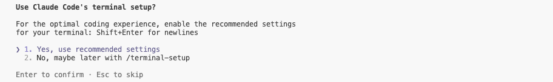

# ハンズオン 1-2: Claude Code を体験

## Claude Code とは

Claude Code は、Anthropic が提供する AI コーディングエージェントです。CLI ツールと VS Code 拡張機能の両方として利用でき、Anthropic の Claude AI モデルと連携して、自然言語でのやり取りを通じて高度なコーディング体験を提供します。

## Step 1: セットアップの実行

### 1-1: Claude Code の起動

```bash
cd /work/workshops/solutions-workshop && ./claude
```

コマンドを実行すると Claude Code が起動します。


## Step 2: Claude Code の設定

基本的には Enter を押していくだけで初期セットアップは完了します。





## Step 3: Claude Code の動作確認

「こんにちは」とプロンプトを入力してみましょう。返答が返ってくれば正常に動作しています。


### 3-1: MCP 利用

MCP の設定をしてみましょう。以下のコマンドで [AWS Document MCP](https://awslabs.github.io/mcp/servers/aws-documentation-mcp-server) を設定してみましょう。

```bash
claude mcp add --transport stdio aws-docs --scope user -- uvx awslabs.aws-documentation-mcp-server@latest
```

`/mcp` で aws-docs が追加されていれば正常に MCP が利用できる状態です。


以下のプロンプトを実行してみましょう。

```bash
# プロンプト
Amazon Bedrock のデータ取扱について、学習に利用されないことを AWS Document MCP で調査してください。
```

一例ですが以下のような結果が返ってきました。ハルシネーションや誤った情報を参照してしまう可能性があるため結果についてはしっかりと確認してください。


**MCP 設定ファイル**

```bash
# CodeServerUser のデフォルトは coder で、Cloudformation テンプレートで定義されています。
CODEUSER=coder && ls /home/${CODEUSER}/.claude.json
```

### 3-2: .claudecoderules 機能

Claude Code の動作をカスタマイズするための `~/.claude/CLAUDE.md` ファイルを使用できます。このファイルをプロジェクトのルートディレクトリに配置するだけで自動的に適用される設定ファイルです。プロジェクト固有の指示や規約を Claude Code に与えることができます。

**演習**

```
# プロンプト
Claude Code の設定ファイルとして ~/.claude/CLAUDE.md を作成してください。日本語で猫のように会話するように指示したいです。
```


## 🎉 ハンズオン 1-2 完遂！

おめでとうございます！ハンズオン 1-2 が完了しました！！
