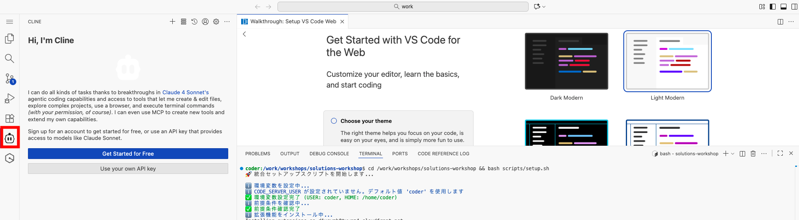

# ハンズオン 1-1: Cline を体験

## Cline とは

Cline は、VS Code 拡張機能、もしくは CLI として動作する AI コーディングエージェントです。ハンズオンでは Amazon Bedrock と連携して、自然言語でのやり取りを通じてコーディングを体験します。

## Step 1: 自動セットアップスクリプトの実行

### 1-1: エクステンションのインストールを実行

```bash
cd /work/workshops/solutions-workshop && bash scripts/setup.sh
```

実行が正常に完了すると左側のサイドバーに Cline エクステンションのマークが出てくるのでクリックします。
Cline の画面が開くと、「Get Started for Free」もしくは「Use your own API key」が出てくるので **Use your own API key** を選択します。



## Step 2: Cline の設定

### 2-1: Cline の初期設定を実施

以下の設定を行って「Let's go!」ボタンをクリックします。

- API Provider: Amazon Bedrock
- AWS Region: us-east-1
- ☑️ Use cross-region inference
- ☑️ Use prompt caching


セットアップが完了するとチャット画面が出てきます。


## Step 3: Cline の動作確認

「こんにちは」とプロンプトを入力してみましょう。返答が返ってくれば正常に動作しています。


### 3-1: MCP 利用

既に MCP の設定は完了しているため [AWS Document MCP](https://awslabs.github.io/mcp/servers/aws-documentation-mcp-server) を利用してみましょう。

```bash
# プロンプト
Amazon Bedrock のデータ取扱について、学習に利用されないことを AWS Document MCP で調査してください。
```


一例ですが以下のような結果が返ってきました。ハルシネーションや誤った情報を参照してしまう可能性があるため結果についてはしっかりと確認してください。


**MCP 設定ファイル**

```bash
# CodeServerUser のデフォルトは coder で、Cloudformation テンプレートで定義されています。
CODEUSER=coder && ls /home/${CODEUSER}/.local/share/code-server/User/globalStorage/saoudrizwan.claude-dev/settings/cline_mcp_settings.json
```

### 3-2: .clinerules 機能

Cline の動作をカスタマイズするための `.clinerules` ファイルを使用できます。このファイルをプロジェクトのルートディレクトリに配置するだけで自動的に適用される設定ファイルです。プロジェクト固有の指示や規約を Cline に与えることができます。

**演習**

```
# プロンプト
https://docs.cline.bot/features/cline-rules  このページをフェッチして .clinerules の設定を行ってください。日本語で猫のように会話するように指示したいです。
```


### 3-3: Cline CLI

[Cline CLI](https://docs.cline.bot/cline-cli/overview) という CLI で利用できるツールが存在します。現状 aws profile を指定しなければ動かないため、ハンズオンではスキップしますが、興味のある方は `aws configure` を設定して試してみてください。

## 🎉 ハンズオン 1 完遂！

おめでとうございます！ハンズオン 1-1 が完了しました！！