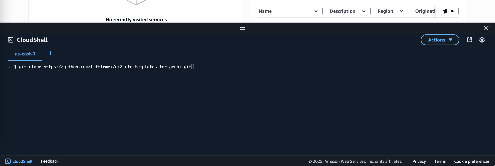
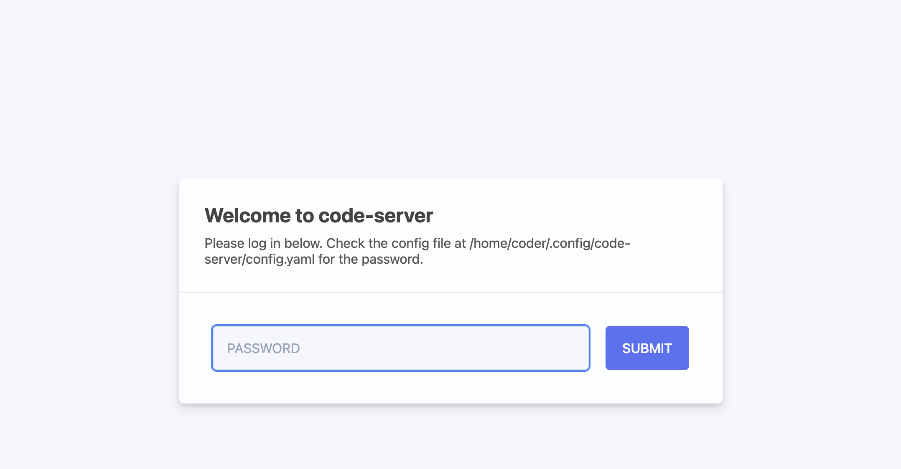
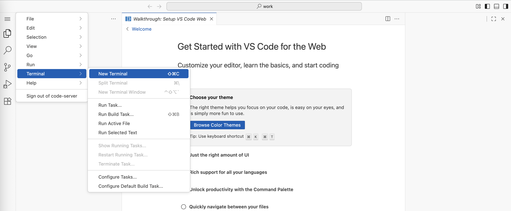

# Code Server セットアップガイド

このガイドでは、ハンズオン作業環境を準備する手順を、画面の写真付きで詳しく説明します。

## 📋 始める前に必要なもの

- **AWS アカウント** AWS のクラウドサービスを使うための検証用 AWS アカウント(Admin 権限推奨)
- **インターネット接続**：安定したインターネット環境
- **ウェブブラウザ**：Chrome、Firefox、Safari など

## 🚀 セットアップの流れ
全体の作業は以下の 4 つのステップに分かれています。

1. **AWS コンソールへログイン**：作業環境を作成するために AWS コンソールにログイン
2. **AWS CloudShell の起動**：作成した環境にアクセスするための情報を取得
3. **AWS Cloudformation を用いて作業環境をデプロイ**: 作業環境のデプロイスクリプトを実行
4. **作業環境への接続**：実際に作業する画面にアクセス

所要時間：約 15 分

## 用語説明

### AWS CloudShell とは？

AWS CloudShell は、AWS コンソール上で使えるコマンドライン環境です。自分のパソコンに何もインストールしなくても、CLI（コマンドラインインタフェース）操作ができます。

### AWS Cloudformation とは？

AWS Cloudformation は、Infrastructure as Code でクラウドプロビジョニングするサービスです。設定ファイルを元に AWS サービスを一式起動してくれるため、常に同じインフラストラクチャ環境を再現できます。


### Code Server（クラウド IDE）とは？

このステップで作成する Code Server は、ブラウザからアクセスできるクラウド IDE（統合開発環境）です。IDE とは、プログラマーがコードを書いたり、実行したり、デバッグしたりするための総合的なツールのことです。

Code Server 環境の特徴:

- **ブラウザベース**：インターネットがあればどこからでもアクセス可能
- **ターミナル統合**：コマンドライン操作とコード編集を同じ画面で実行
- **ファイル管理**：ローカル PC のファイルにエージェントが勝手にアクセスしてデータ漏洩することを防止
- **組織管理が容易**: パッケージや使えるツール、外部アクセスの統制管理が容易
- **AWS サービスアクセス**: 作業環境に Amazon Bedrock 等へのアクセス権限を付与済みのため設定不要で生成 AI にアクセス可能

## Step 1: AWS コンソールへログイン

**1-1: AWS コンソールにログイン**

  - [AWS コンソール](https://console.aws.amazon.com/) にアクセス
  - あなたの AWS アカウントでログイン

## Step 2: AWS CloudShell の起動

**2-1: CloudShell を開く**


  - 画面上部の検索バーに「CloudShell」と入力
  - 「CloudShell」をクリック

**2-2: 必要なファイルをダウンロード**
   
   


   CloudShell の画面が開いたら、以下のコマンドを **一行ずつ** 入力してください。コマンドを入力したら「Enter」キーを押します。

   ```bash
   git clone https://github.com/littlemex/ec2-cfn-templates-for-genai.git
   ```
   
   このコマンドは、必要なファイルをインターネットからダウンロードします。

## Step 3: AWS Cloudformation を用いて作業環境をデプロイ

**3-1: ディレクトリ（フォルダと似た概念）に移動して作業環境をデプロイ**
   
このコマンドで Code Server をデプロイします

```bash
# /work ディレクトリにいるはずです
cd ec2-cfn-templates-for-genai/workshops/solutions-workshop && bash cfn_manager.sh create && bash cfn_manager.sh monitor -n vscode-server-cloudshell-user -r us-east-1
```

## Step 4: 作業環境への接続

Step 3 で作業環境の作成を開始しました。デプロイ完了まで約 10 分かかります。

**4-1: 完成を待つ**
   
作成の進行状況が表示されます。「作成中...」のような表示が出ている間は、完成まで待ちましょう。

**4-2: 接続情報の確認**
   
作成が完了すると、以下のような情報が表示されます。

```
[SUCCESS] 🎯 Code Server準備完了!
[VSCODE] 🌐 Code Server URL:
https://xxxxx.cloudfront.net/?folder=/work
[INFO] 🔑 接続パスワード:
PNSrIHZ15TRwWc89(例)
[INFO] 💡 アクセス方法:
1. ブラウザでURLにアクセス
2. パスワード入力画面で上記パスワードを入力
```

**4-3: 情報をメモ**
   
- **URL**（https://で始まる長い文字列）をコピーしてメモ帳などに保存
- **パスワード**（英数字の組み合わせ）もメモ帳に保存

**Code Server にアクセス**
   
新しいブラウザタブを開いて、メモした URL にアクセスしてください。

**4-4: パスワードを入力**
   
パスワード入力画面が表示されるので、メモした接続パスワードを入力してください。



**4-5: Code Server 画面の確認**
   
正しいパスワードを入力すると、Visual Studio Code のような画面が表示されます。これが Code Server です。



Code Server の画面構成:

  - **左側のサイドバー**：ファイルやフォルダの一覧が表示される
  - **中央のエディタ**：コードを書いたり編集したりする場所
  - **下部のターミナル**：コマンドラインで指示を出す場所（これから開きます）
  - **上部のメニューバー**：ファイル操作や設定を行う場所

**4-6: ターミナルを開く**
   
画面上部のメニューから「Terminal」→「New Terminal」をクリックしてください。


ターミナルが開くと、`coder:/work/$` のような文字が出てきます。ここにカーソルを当てると文字を入力でき、エンジニアはこのターミナルで様々なコード開発作業を行います。

## 🎉 作業環境の作成完了

おめでとうございます！作業環境の作成が正常に完了しました。[README.md](./README.md) に戻りましょう。
