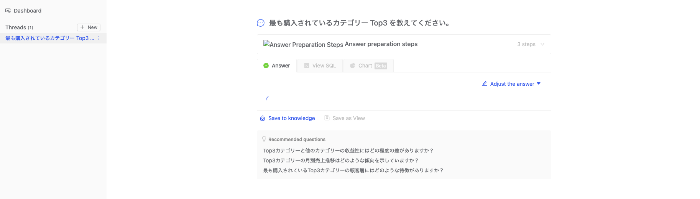

# ハンズオン 2-1: Generative BI を体験

このハンズオンでは Open Source(OSS) の Genearative BI ツールを利用します。Amazon Bedrock の Claude をモデルとして利用した Generative BI を実現する AI エージェントがバックエンドで動いています。

## Step 1: セットアップスクリプトの実行

### 1-1: セットアップ実行

OSS Generative BI ツールと Amazon Bedrock の連携環境を簡単にセットアップするためのスクリプトを実行します。

```bash
export AWS_REGION_NAME=us-east-1 && cd /work/workshops/solutions-workshop/genbi && scripts/setenv.sh && ./scripts/setup-bedrock-permissions.sh && scripts/deploy.sh
```

> IAM ロール 'current-work-EC2Stack-VAM-xxx-yyy' にポリシーをアタッチしますか？ (y/n)

と聞かれた場合は `y` を入力してエンターを押してください。

実行が完了すると以下のように Generative BI を試すための UI パスが表示されるため新しいタブで開いてください。

**注意 1: コンテナの起動に時間がかかるため起動してすぐはアクセスできない可能性があります。**

**注意 2: https://xxx.cloudfront.net/absproxy/3000/setup/connection のようなパスに遷移してロード画面が出続けることがありますが /setup/connection を削除して開き直してください**

```bash
API エンドポイントをテスト中...
API への接続に成功しました

=== テスト結果サマリー ===
テスト完了時刻: Mon Oct 27 00:36:42 UTC 2025
統合テストが完了しました

UI: http://https://xxx.cloudfront.net/absproxy/3000/ をオープンしてください。
```

## Step 2: Generative BI 体験

### 2-1: PostgreSQL の接続

立ち上げた Generative BI ツールからローカルコンテナで立ち上げた PostgreSQL に接続します。
画像の手順で作業を進めてください。


- Display name: postgres-test-1
- Host: postgres
- Port: 5432
- Username: wrenuser
- Password: postgres
- Database name: wrendb


あとは自然言語で Generative BI を体感してみましょう!

```bash
# プロンプト例
最も購入されているカテゴリー Top3 を教えてください。
```

**注意: 処理がずっとぐるぐるしている場合はリロードしてみてください。**




## 🎉 ハンズオン 2-1 完遂！

おめでとうございます！ハンズオン 2-1 が完了しました！！