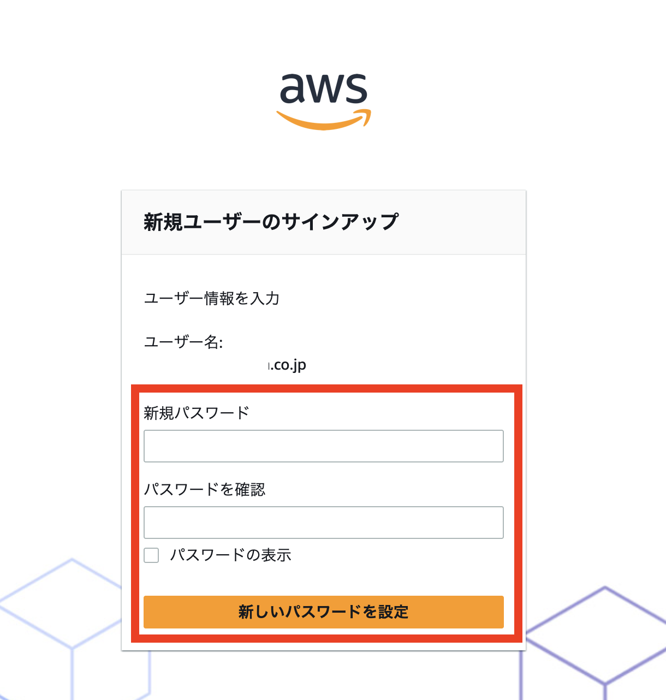
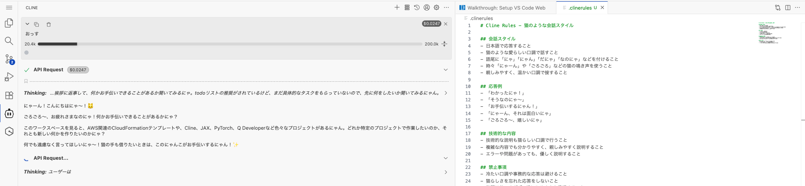

# ハンズオン 1-3: Amazon Q Developer CLI を体験

## Amazon Q Developer CLI とは

Amazon Q Developer CLI は、Amazon が提供する AI コーディングエージェントです。CLI と IDE で利用することができます。

## Step 1: Amazon Q Developer の初期設定

### 1-1: Amazon Q Developer コンソールを開く
   
新しいブラウザタブで [Amazon Q Developer コンソール](https://us-east-1.console.aws.amazon.com/amazonq/developer/home?region=us-east-1) にアクセスしてください。


### 1-2: 初期設定を開始
   
画面に表示される「Get Started」ボタンをクリックしてください。


### 1-3: ユーザー情報を入力
   
「Create your user」画面が表示されます：
   
- **Email address**：認証コードを受信できるメールアドレスを入力
- **First name**：あなたの名前（例：太郎）
- **Last name**：あなたの苗字（例：山田）
   
入力が完了したら「Continue」をクリックしてください。


### 1-4: プロファイル作成
   
「Create」ボタンをクリックして、Amazon Q Developer のプロファイルを作成してください。


### 1-5: 設定完了の確認
   
正常に設定が完了すると、成功画面が表示されます。


**💡 ポイント**
- メールアドレスは必ず受信可能なものを使用してください
- 数分後に招待メールが届きます
- この画面は開いたままにしておいてください

## Step 2: ユーザー登録の完了

Step 1 で入力したメールアドレスに招待メールが届きます。そのメールを使って、あなた専用のアカウントを完成させます。

### 2-1: 招待メールを確認
   
Step 1 で入力したメールアドレスの受信箱を確認してください。「Amazon Q Developer への招待」のようなタイトルのメールが届いているはずです。

### 2-2: 招待を受諾
   
メール内の「Accept Invitation」ボタンをクリックしてください。


### 2-3: パスワードを設定**
   
新しいパスワードを入力する画面が表示されます：
   
- 8 文字以上で、大文字・小文字・数字を含むパスワードを入力
- 確認のため、同じパスワードをもう一度入力
- 「新しいパスワードを設定」をクリック



### 2-4: 登録完了の確認**
   
ユーザー登録が完了すると、ログイン画面が表示されます。


**⚠️ 重要**
- この時点ではまだログインしないでください、検証時のみ手順簡素化のために MFA を無効化します
- **イベント後に必ず MFA を有効化、もしくはユーザーを削除**してください
- ログイン画面が表示されたら、そのタブは閉じて構いません
- パスワードは忘れないようにメモしておいてください

## Step 3: Amazon Q Developer CLI へのログイン

作業環境で Amazon Q Developer CLI を使えるようにするため、先ほど作成したアカウントでログインします。

### 3-1: 作業ディレクトリに移動
   
ターミナルに以下のコマンドを入力してください。
   
```bash
cd /work/ec2-cfn-templates-for-genai/workshops/solutions-workshop
```

### 3-2: ログイン支援スクリプトを実行
   
以下のコマンドを入力してください。このスクリプトは作業手順を簡素化するためのラッパースクリプトです。

**注意: 複数の Identity Center の Start URL がある場合を検証していないためうまく動作しない可能性があります。その場合は `q chat` コマンドを手動で実行してください。**
   
```bash
./q-login
```

### 3-3: 質問に答える
   
スクリプトが実行されると、いくつか質問されます。基本的に「y」と入力して「Enter」を押してください。

```
🤔 Do you want to open MFA settings in browser to configure? (y/N): y
```
   
「y」と入力して「Enter」すると、AWS コンソールが開きます。

ワークショップでは作業ステップが増えるため MFA を無効化します。（検証アカウント以外では無効化しないでください）
   
「Configure」→ 「Never」→ 「Save Changes」の順でボタンを押して無効化しましょう。


```
✅ Have you disabled MFA (set to 'Never')? (y/N): y
```
   
「y」と入力して「Enter」

```
🤔 Do you want to execute this command now? (y/N): y
```
   
「y」と入力して「Enter」

### 3-4: ブラウザでの認証
   
「Do you want code-server to open the external website?」という確認が出たら「Open」をクリックしてください。


### 3-5: ログイン情報を入力
   
新しいタブでログイン画面が開きます：
   
- **ユーザー名**：Step 3 で入力したメールアドレス
- **パスワード**：Step 4 で設定したパスワード


### 3-6: 認証リクエストを承認
   
ログインが成功すると、認証リクエスト画面が表示されます。内容を確認して承認してください。


### 3-7: データアクセスを許可
   
最後に「アクセスを許可」をクリックしてください。


**💡 ポイント**
- MFA（多要素認証）は、セキュリティを高める仕組みですが、今回は学習目的のため無効にします
- 本番環境では MFA を有効してください
- ログインに成功すると「Logged in successfully」と表示されます

### 3-8: ログイン成功の確認
   
ターミナルに「Logged in successfully」と表示されていることを確認してください。

### 3-9: チャット機能を試す
   
以下のコマンドを入力してください。
   
```bash
q chat
```

## Step 4: Amazon Q Developer CLI の動作確認

Amazon Q Developer CLI が正しく設定されているかを確認し、実際に会話してみましょう。
   
「こんにちは」とプロンプトを入力してみましょう。返答が返ってくれば正常に動作しています。


### 4-1: MCP 利用

既に MCP の設定は完了しているため [AWS Document MCP](https://awslabs.github.io/mcp/servers/aws-documentation-mcp-server) を利用してみましょう。

```bash
# プロンプト
Amazon Bedrock のデータ取扱について、学習に利用されないことを AWS Document MCP で調査してください。
```


一例ですが以下のような結果が返ってきました。ハルシネーションや誤った情報を参照してしまう可能性があるため結果についてはしっかりと確認してください。


**MCP 設定ファイル**

```bash
# CODEUSER のデフォルトは coder で、Cloudformation テンプレートで定義されています。
CODEUSER=coder && ls /home/$CODEUSER/.aws/amazonq/mcp.json
```

### 4-2: .clinerules 機能

Cline の動作をカスタマイズするための `.clinerules` ファイルを使用できます。このファイルをプロジェクトのルートディレクトリに配置するだけで自動的に適用される設定ファイルです。プロジェクト固有の指示や規約を Cline に与えることができます。

**演習**

```
# プロンプト
https://docs.cline.bot/features/cline-rules  このページをフェッチして .clinerules の設定を行ってください。日本語で猫のように会話するように指示したいです。
```



### 4-3: Amazon Q Developer IDE

Amazon Q Developer を IDE で利用することもできます。CLI の設定が完了していれば同じログイン設定を利用して IDE も利用することができます。


ログインすると IDE 上でコーディングエージェントを利用できます。


## 🎉 ハンズオン 1-3 完遂！

おめでとうございます！ハンズオン 1-3 が完了しました！！

## おまけ

```bash
q chat --no-interactive "テトリスを作成してください。0.0.0.0:3001でNodeサーバーを起動してください。" --trust-all-tools
```

ちゃんと自力でコードを書こうとすると数時間はかかると思いますが、一瞬で作成されましたね。


