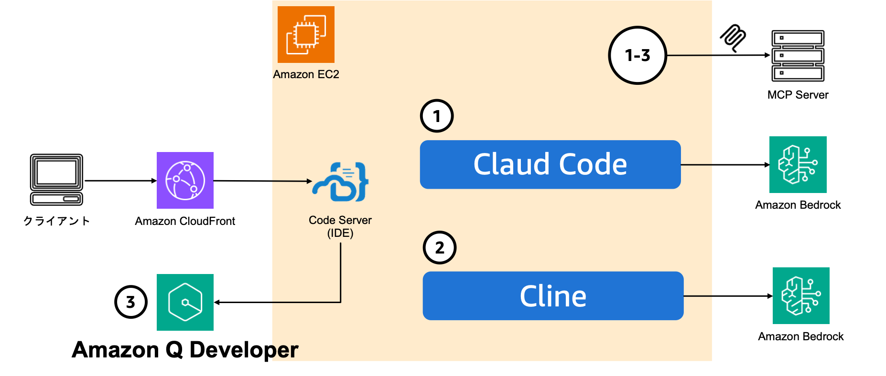
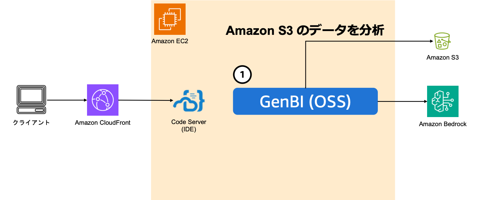

# AWS 生成 AI ソリューションワークショップ - ハンズオン

実施時間: 1 時間

## 概要

一時間でコーディングのための作業環境の起動し、ハンズオン 1 で複数のコーディングエージェントを AWS 内で構築された環境から利用します。ハンズオン 2 では Amazon Bedrock と Amazon S3 のみを用いて Generative BI(GenBI) とはどのようなものかを OSS GenBI ツールを用いて体感します。

## ハンズオン構成概要

### [10 分] ハンズオン 0: 早速デプロイ

デプロイには時間がかかるためまずは手順通りにデプロイ作業を開始しましょう。

[README-code-server.md](./README-code-server.md) を新しいタブで開いて作業を実施してください。

### [30 分] ハンズオン 1: コーディングエージェント環境



上記の図はハンズオン 0 でデプロイしてもらった作業環境のアーキテクチャ概要です。

**💡 ポイント**

- 1. クラウド IDE を利用することで個人のローカル端末を汚染せずに全員が同じ環境を利用可能
- 2. 同じ環境で Amazon Q Developer、Cline、Claude Code を利用可能
- 3. MCP 設定など必要なライブラリをすでに設定済み
- 4. 発展: Amazon Bedrock にガードレールを設定することで統一したガードレールを適用可能

**各コーディングエージェントの体験**

Amazon Q Developer は設定に多少時間がかかります。もし AWS Identity Center のトラブルやうまく設定ができない際には 1-1 もしくは 1-2 の実施後に先にハンズオン 2 に進むことを推奨します。

30 分で全て実施する時間はないため以下から一つを選択してください。

- 1-1: Cline: [README-claude-code.md](./README-claude-code.md) を新しいタブで開きます
- 1-2: Claude Code: [README-cline.md](./README-cline.md) を新しいタブで開きます
- 1-3: Amazon Q Developer: [README-qdev.md](./README-qdev.md) を新しいタブで開きます

### [20 分] ハンズオン 2: Generative BI 環境



上記の図はハンズオン 0 でデプロイしてもらった作業環境のアーキテクチャ概要です。

**💡 ポイント**

- 1. Amazon Bedrock と Amazon S3 のみがあれば Generative BI を体感可能
- 2. 組織での利用をご検討の際は Amazon Quick Suite を推奨 ([Workshop Link](https://catalog.us-east-1.prod.workshops.aws/workshops/119307ce-4c43-4e96-887c-cd8454b3d229/en-US))

**Generative BI の体験**

- 2-1: Cline: [README-genbi.md](./README-genbi.md) を新しいタブで開きます

## 🎉 ハンズオン完遂！

おめでとうございます！ハンズオンが完了しました！！
ぜひ、AWS でコーディングエージェントと Generative BI をお試しください！

[Kiro](https://kiro.dev/) もぜひお試しください！

### 環境の削除

**注意: 検証用途のためセキュリティへの配慮は限定的です、検証用アカウントをご準備いただいているはずですが、念の為ハンズオン 1,2 の完了後は環境を削除して社内のセキュリティレビューを実施してから自己責任でご利用ください。AWS System Manager Session Manager によるポートフォワード経由の Code Server へのアクセスはよりセキュアです。**

```bash
bash cfn_manager.sh delete -n vscode-server-cloudshell-user
```