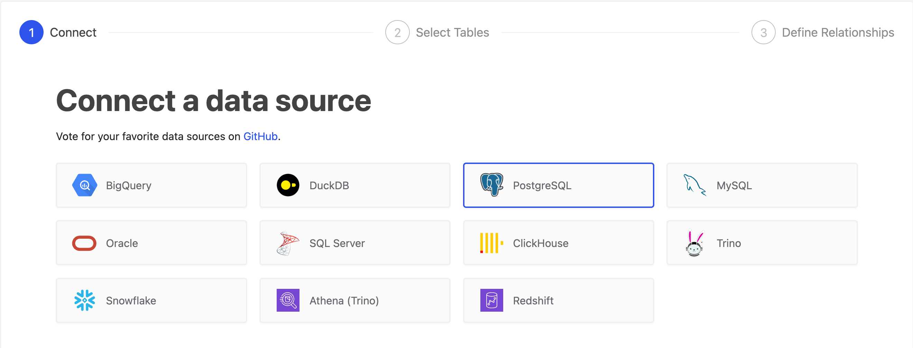
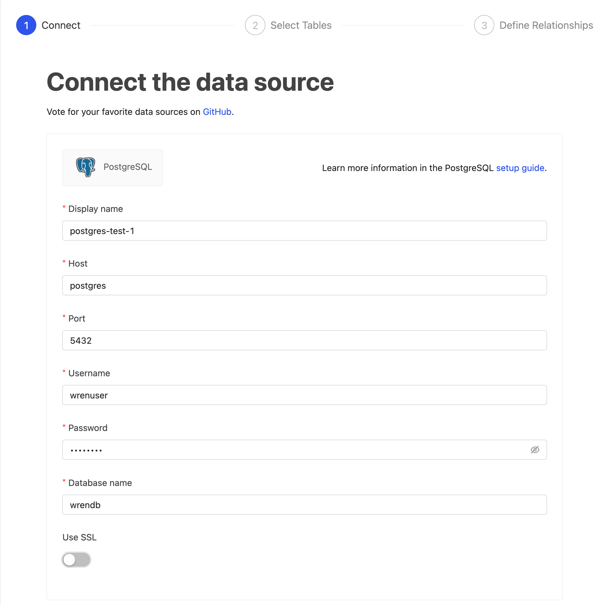
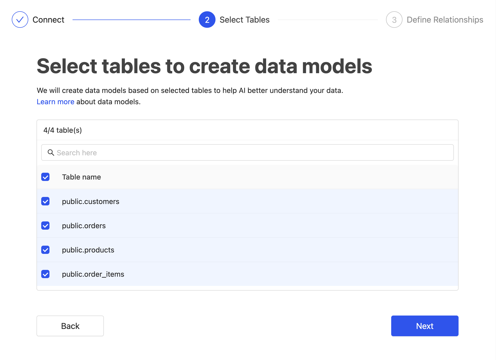
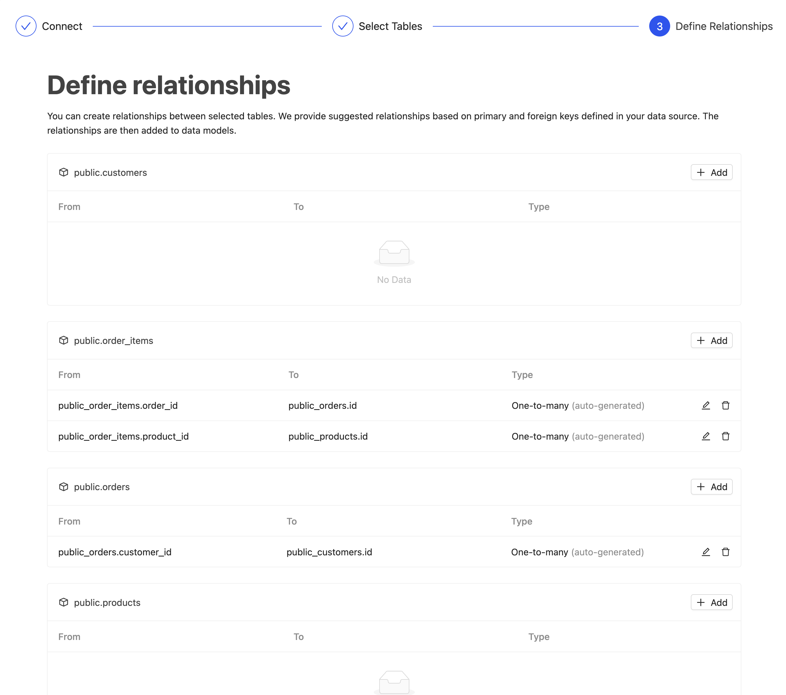
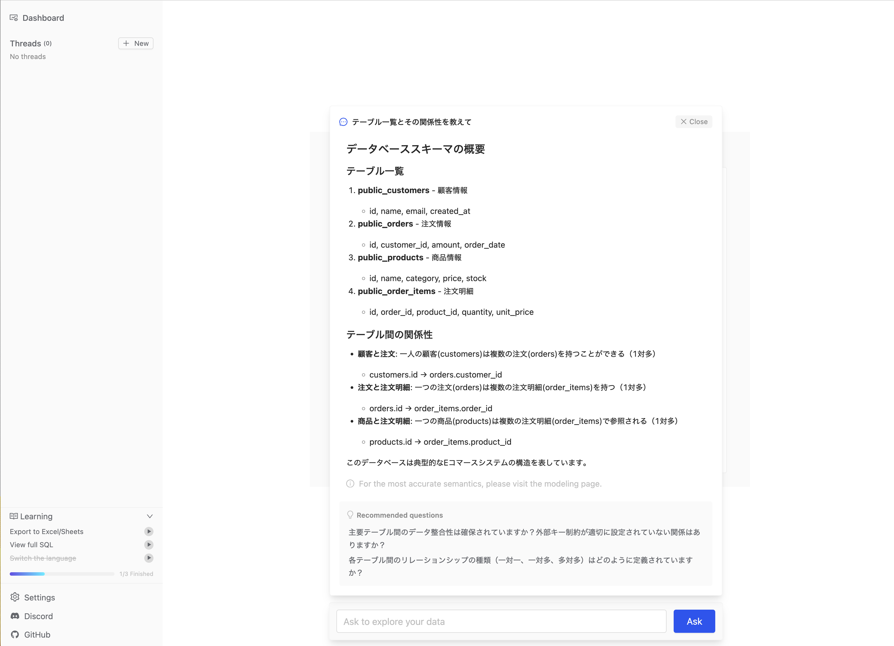
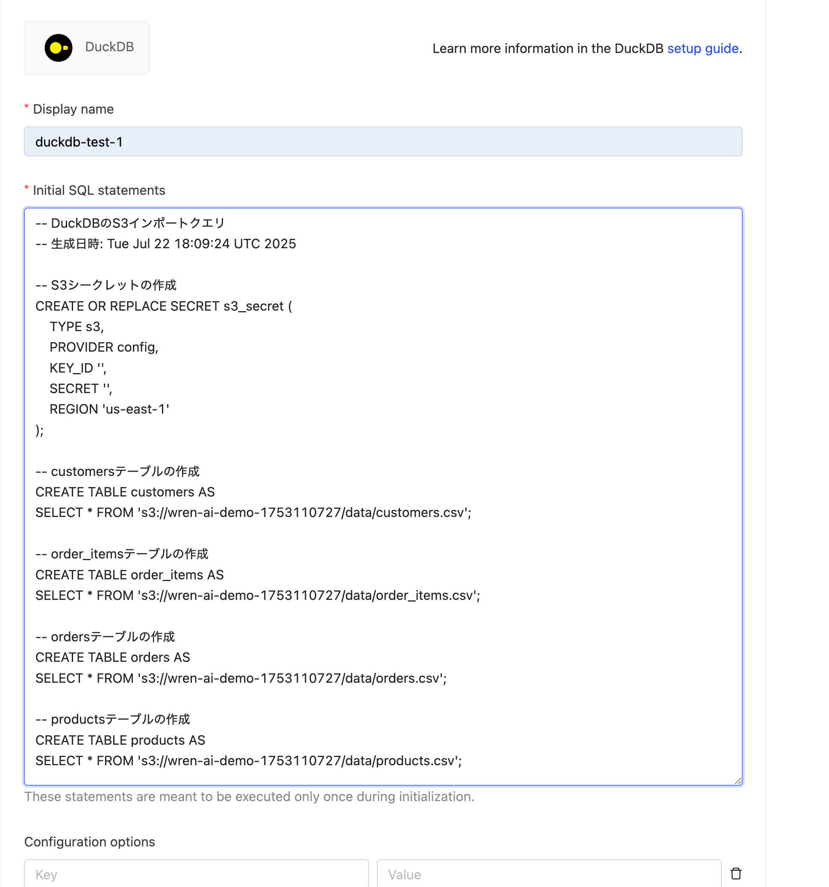
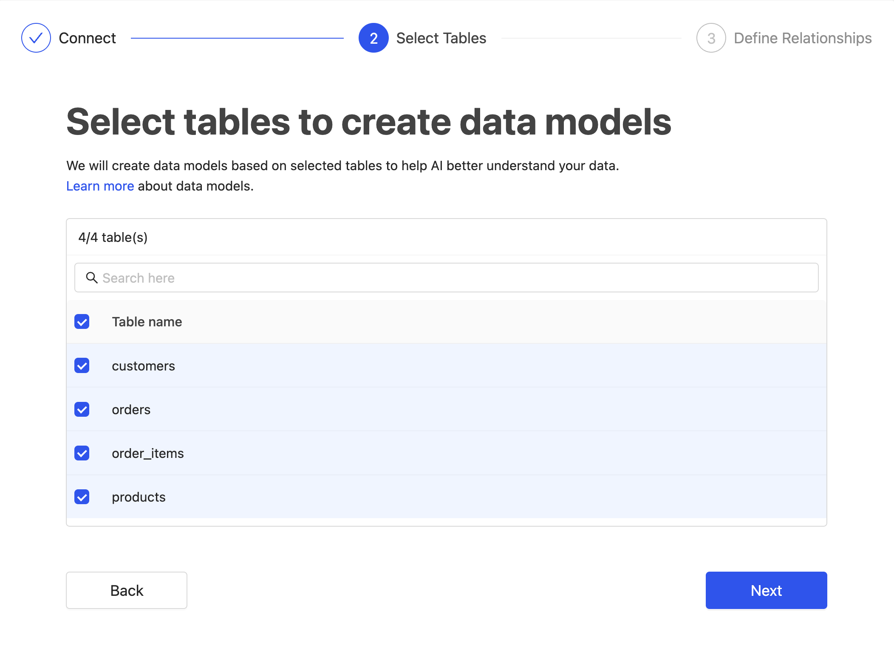
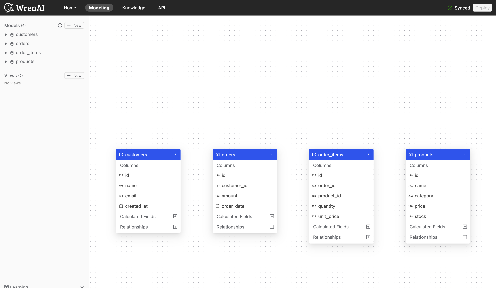

# Wren AI + PostgreSQL + Amazon S3 + Amazon Bedrock デモ

このプロジェクトは、Wren AI、PostgreSQL、Amazon S3、Amazon Bedrock を使用したデータ分析環境のデモです。PostgreSQL のデータを Amazon S3 に ETL し、Wren AI と Amazon Bedrock の Claude モデルで分析する流れを実装しています。

## プロジェクト構成

- **PostgreSQL**: ダミーサービスデータを格納するデータベース
- **S3/MinIO**: ETL 後のデータ保存先
- **Wren AI**: Amazon S3 のデータを DuckDB 経由で分析するツール

## セットアップ手順

### 前提条件
- Docker と Docker Compose がインストールされていること
- AWS CLI がインストールされ、適切に設定されていること
- Amazon Bedrock へのアクセス権限を持つ IAM ロールが設定されていること
- AWS_REGION_NAME 環境変数が設定されていること（デフォルト: us-east-1）

### 1. セットアップスクリプトの実行

このリポジトリには、Wren AI と Amazon Bedrock の連携環境を簡単にセットアップするためのスクリプトが含まれています。

**最も基本的な動作確認**

```bash
# 必要に応じて export AWS_PROFILE=xx を設定してください。

# セットアップスクリプトを実行
./scripts/setup-wren.sh

# Bedrock のアクセス権限の設定
./scripts/setup-bedrock-permissions.sh

# 統合テストを実行、docker 起動して health チェックまで実施します
./scripts/integration-test.sh
```

localhost:3000 で UI にアクセスしてください。公式の [Get Start](https://docs.getwren.ai/oss/getting_started/sample_data/hr) を確認しながら UI からサンプルデータを用いて動作を確認できます。

## Postgres 設定画面

> step 01


> step 02


> step 03


> step 04


> step 05


## DuckDB with Amazon S3 設定画面 

```bash
# Amazon S3 の作成と .env へのバケット情報の環境変数の追加
./scripts/setup-s3.sh

# MCP でのライブ ETL を実施した想定で PostgreSQL から CSV 作成して S3 に Push
./scripts/etl-sample.sh

# DuckDB の設定用のクエリを生成させる、認証情報は環境変数で設定ください。
./scripts/generate_duckdb_queries.sh
```

> step 06


> step 07


> step 08


## トラブルシューティング

**Amazon Bedrock モデルのアクセス権限設定**

Amazon Bedrock のモデルを使用するには、AWS コンソールで以下の設定が必要です。

1. AWS コンソールにログイン
2. Amazon Bedrock サービスに移動
3. 「Model access」を選択
4. 使用したいモデル（Claude 3.7 Sonnet、Claude 3.5 Sonnet など）にチェックを入れる
5. 「Request model access」をクリック
6. アクセス権が付与されるまで待つ（通常は数分以内）

詳細は [Amazon Bedrock ドキュメント](https://docs.aws.amazon.com/bedrock/latest/userguide/model-access.html) を参照してください。